# codebus v3 — Implementation Feedback for Design

> Prepared by the codebus engineering team, 2026-05-26.
> Audited against `design-handoff/README.md` v1 spec across 8 visual surfaces.
> All screenshots are real captures from the Tauri/WebView2 desktop app on
> Windows 11, 1920×1080 @ 100% scaling, zh-tw locale, against a small
> `cc-haha` test vault.

## TL;DR

We've shipped most of the v1 design across the six core screens. A handful
of patterns from the spec aren't quite landing — usually because the spec
makes assumptions that don't translate well to Windows desktop / CJK / our
multi-step quiz flow. We also discovered five screens the spec didn't cover
(LoadingOverlay, Wiki tab x3, Quiz wizard x4, 02c Interrupted), where we'd
appreciate design input.

The main themes we want to flag:

1. **Linear-tight typography is too small on Windows 100% scaling.** Bumping
   every token up one step (13→14 body, 11→12 meta, etc).
2. **i18n implementation is incomplete.** Three subcomponents
   (`EndpointSection`, `CodexEndpointSection`, `SetKeyDialog`) and several
   workspace pieces are still hard-coded English; we have a clean plan to
   fix.
3. **CJK section labels lose the uppercase + tracked micro-label affordance**
   ("快速開始" doesn't have an uppercase form). Needs an alternative visual
   strategy.
4. **Border hairlines are below the visible-contrast threshold** on real
   monitors (`#1f1f1f` on `#0a0a0a` reads as no line at all).
5. **`+ New goal` / `+ New quiz` CTA placement disagrees with spec** — they
   sit in the topbar (drag region) instead of inside the content header row.
6. **ChatWidget (collapsed) overlaps the Goal Running Cancel button** in
   bottom-right. We'll fix by moving Cancel to header right per spec — the
   current footer placement is also a spec mismatch.
7. **05 Cmd+K Overlay: we decided to cut it.** Functionality fully overlapped
   with ChatWidget; no UI ever surfaced its existence. Cmd+K stays as
   ChatWidget toggle.
8. **Vault as UI term: removed.** "Vault" was Obsidian carry-over;
   newcomers don't know it. Replaced with plain Chinese ("最近" / "+ 新增").
   The internal data model still uses `VaultEntry`.

The rest of this document walks each surface with screenshots, what's
landing well, and the gaps. Open questions for design are collected at the
end.

---

## Methodology

We audited each visual surface in implementation order (Lobby first because
that's where users start). For each:

1. Capture the real WebView2 render via CDP (no design-time stylesheets).
2. Compare against the spec section + corresponding `design_files/*.jsx`.
3. List gaps grouped by severity: **bug** (broken), **spec gap**
   (implemented but diverged), **design gray area** (not in spec), **i18n
   gap** (hard-coded strings).
4. Cross-cutting issues that span multiple surfaces are extracted into their
   own section.

Internal Mandarin notes live in `AUDIT.md` next to this file — same
findings, but tagged with our internal IDs (G1, W4, etc) and decision logs.

---

## Cross-cutting Concerns

### C1. Typography scale — Linear-tight is too small on Windows

Spec scale (mock readings):

| token | spec | landed feel on Win/100% |
| --- | --- | --- |
| body 13 | row text, nav | small; vault path mono is borderline unreadable |
| meta 11 | timestamps, paths | very small |
| micro 10 | uppercase section labels | borderline |
| h-row 18 | screen titles | OK |
| h-empty 24 | empty-state hero | feels light against the empty space |

The design was clearly tested on macOS Retina; Windows at 100% scaling
renders ~1.5× denser, and CJK glyph hinting at 11–13px is noticeably
softer than Latin. Our decision is to bump every token up one step
(13→14, 11→12, 10→11, 18→20, 20→22, 22→24, 24→28). Headings included so
relative scale stays intact.

We're skipping a user-level font-scale setting for now — that's
speculative until we know the new defaults are still wrong.

### C2. i18n — surgical gaps, not architectural

The i18n architecture is solid (typed bundle, `useT`, locale-aware
fallback, localized error envelopes). The implementation has three
specific holes:

- **Cat A: Endpoint subcomponents fully hard-coded English.**
  `EndpointSection.tsx`, `CodexEndpointSection.tsx`, `SetKeyDialog.tsx` —
  every label, button, placeholder, status badge. (See screenshot 06.)
- **Cat B: Several workspace components have hard-coded strings.**
  `QuizAnswering`, `QuizReview`, `QuizTab`, `NewGoalModal`, `ChatInput`,
  `GoalsTab` empty-state text, multiple `← back` labels.
- **Cat C: aria-label / title attributes bypass i18n.**
  `ChatWidget` open/resize/minimize, `WikiTab` tree toggle, `Dialog`
  close button, three `title="Page not found"` instances.

Reserved English (design-decision exceptions, not bugs):

- **Tab labels** `Goals` / `Wiki` / `Quiz` — codebus core nouns + CLI verbs.
- **CLI verb names** `goal` / `query` / `fix` / `verify` / `chat` — match
  `~/.codebus/config.yaml` keys.
- **Codex effort values** `low` / `medium` / `high` / `xhigh` — codex API
  enum.
- **PII action enum** `warn` / `mask` / `block`.
- **Config YAML key names** `base_url` / `api_version` / `keyring_service`.

The reasoning we're applying: anything users *touch* (labels, buttons,
hints) gets translated. Anything users *learn as a domain term that also
appears in the CLI/config* stays English.

### C3. CJK section labels — uppercase-tracked micro-label doesn't apply

Spec calls for `font-size: 10; font-weight: 600; uppercase; tracking:
0.12em` for "VAULT", "RECENT", "QUICKSTART", "WIKI PAGES CHANGED" etc.
This produces a beautiful Linear-style ceremonial label in English.

Chinese has no uppercase. "快速開始" with the same CSS just renders as
10px bold — which is too small to read and loses the ceremonial feel.
Worse, "近期 VAULT" (mixed) is visually broken: the uppercase tracking
applies only to the Latin fragment and looks like a bug.

We don't have a final answer here. Candidates:

- Drop the section label when there's only one group (we're doing this
  for Workspace sidebar — no "VAULT" label since there's just one nav
  group).
- Add an amber 4px left bar or dot prefix as the "section" affordance,
  letting the CJK text be regular weight.
- Use a small box outline (1px border, 11px padding) to give it a
  badge-like presence.

**This is an open question we'd love design's input on.**

### C4. Border hairlines below visible threshold

Spec sets default borders at `--border: #1f1f1f` on `--bg: #0a0a0a`. In
the design mock (Figma-like canvas) these read clean. On our actual
WebView2 render at 1920×1080 they're effectively invisible. We checked
multiple monitors; it's not a calibration issue, it's a real perceptual
floor. Affected places:

- Topbar bottom border in Lobby and Workspace
- Footer top border
- Sidebar/content vertical separator in Workspace
- Wiki tree/preview separator
- Goal table row dividers (these are spec'd subtle, but invisible isn't subtle)

We're going to bump default borders to `--border-strong: #2a2a2a` and
keep `--border: #1f1f1f` only for *very subtle* dividers (in-card row
separation). Could be a screen-rendering / sub-pixel issue specific to
Windows ClearType — worth double-checking on Mac before we lock the new
token.

### C5. Status indicator — three states, not two

Spec describes two states for goal rows: `green dot = done`, `red dot =
failed`. In practice we needed three:

- **Done** (green) — goal finished cleanly
- **Interrupted** (amber) — app closed mid-run, user cancelled, network
  drop; can be retried losslessly
- **Failed** (red) — hard LLM/system error; can't be retried automatically

This shows up in `02c Interrupted` (a whole detail view the spec doesn't
have). We'd like to standardize the three-state token system across:

- Goals list dot
- Goal Detail header pill (`Running` amber / `Done` green / `Interrupted`
  amber-warn / `Failed` red)
- Quiz history result tag (`pass` / `fail`)
- Wiki page changed badge (`new` / `updated`)

### C6. ChatWidget — collapsed bubble collides with Goal Cancel

The floating ChatWidget bubble sits at `bottom: 16, right: 24`. The Goal
Running view places its Cancel button in the footer right (also
`bottom-right`). They overlap. Visible in screenshot `02a-goal-running`.

The fix is twofold:

- Move Goal Cancel to the title row right side, per `02a` spec.
- Replace the `💬` emoji with a `lucide MessageSquare` icon. The emoji
  is the only cartoon element left in the app and doesn't fit the
  Linear-tight aesthetic.

### C7. CTA placement — topbar vs content header

The spec consistently places primary CTAs (`+ New Goal`, `+ New quiz`) in
a content header row, right side, paired with a screen title `<h1>`. We
landed them in the topbar (drag region) right side instead. This means:

- The Workspace topbar is doing two jobs (window drag + action) which
  feels cluttered next to the OS window controls.
- There's no screen `<h1>` ("Goals", "Quiz") in either view.

We'll move CTAs back into a proper content header row to match spec.

### C8. Codex CLI shell wrapper pollution

(This is a codex-provider integration issue, not really a design topic —
flagging because it's visible to users in every Goal/Quiz activity stream.)

When the codex provider executes a shell tool, the command surface comes
through as `"C:\\Windows\\System32\\WindowsPowerShell\\v1.0\\powershell.exe"
-Command "<actual cmd>"`. The wrapper eats 60+ chars, then the activity
row truncates at 80, so the actual command is unreadable. Fix is
client-side wrapper detection + extraction in `ActivityStreamItem`.

Related: the wrapper isn't started with UTF-8, so PowerShell mangles CJK
output. The LLM detected it mid-run and re-issued shell calls with
`-NoProfile`. Token waste; needs a codex-side or wrapper-side fix.

---

## Per-screen Review

### 04 · Lobby

#### 04b · Empty

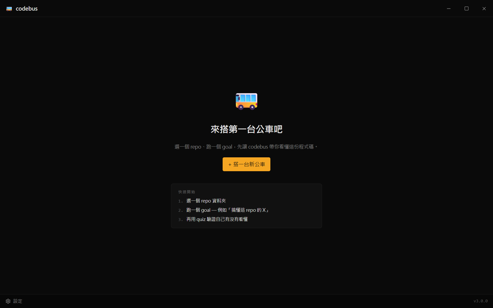

**Aligned:** 🚌 wordmark, 🚌 56px hero, "來搭第一台公車吧" h-empty, amber
primary CTA, Quickstart card with 3 numbered steps, footer with gear +
version.

**Gaps:**

- **G1. Hero is vertically dead-centered**, leaving ~25% empty space
  above and below. Spec implies content sits upper-center with the
  lobby footer pinned. The dead-center placement is the main cause of
  the "unfinished" feeling here.
- **G2. Quickstart step 2 missing amber `cb-qs-quote` pill.** Spec
  defines an inline amber-tinted mono pill for the example goal text;
  we render it as plain prose with Chinese quotation marks. That pill
  is the *only* accent on this card — without it the card is
  entirely tonal.
- **G3. Step numbers are `1.` `2.` `3.` (dot suffix, default OL).**
  Spec uses mono digits, no dot, dim color.
- **G4. "快速開始" section label can't do uppercase-tracked.** See
  cross-cutting C3.
- **G5. Topbar bottom border invisible.** See C4.
- **G6. Lobby footer has no top border and no sunken background**, so
  the gear/version look like they're floating, not anchored.
- **G7. Quickstart card vertical density feels loose**, partly because
  of G3, partly accumulated `space-y-2` + `mt-2`.

**Open idea:** harry would like the hero 🚌 to have a subtle "bumpy
road / idling in place" animation in this empty state only (not the
topbar 🚌, not any other surface). Vertical 2px bob + horizontal 1px
shake, ~1.4s loop, gated on `prefers-reduced-motion`. Bounded to a
low-frequency screen (after first vault add, users never see this
again), so the cute-but-noisy risk is low.

Copy revision in flight (harry has approved):

| key | from | to |
| --- | --- | --- |
| `lobby.empty.subtitle` | "選一個 repo、跑一個 goal，先讓 codebus 帶你看懂這份程式碼。" | "指一份程式碼資料夾、想一個想搞懂的問題，codebus 邊讀邊幫你做筆記。" |
| step 1 | "選一個 repo 資料夾" | "選一份程式碼資料夾" |
| step 2 | "跑一個 goal — 例如「搞懂這 repo 的 X」" | "想一個想搞懂的問題（goal）— 例如「auth 怎麼運作」" |
| step 3 | unchanged | unchanged |

Reasoning: "repo" is too git-specific (codebus accepts any code folder);
"goal" is internal jargon users don't know yet. We introduce `goal`
once, in parens, on step 2 — so users have learned the term before they
enter Workspace and see the `Goals` tab.

#### 04a · Populated

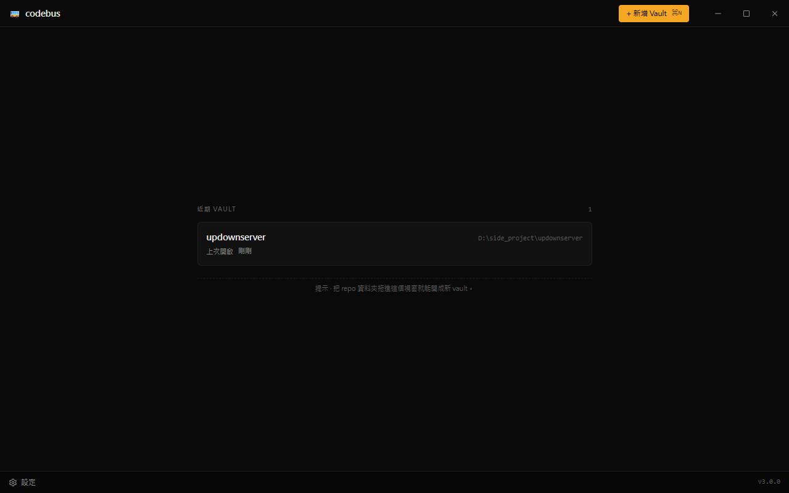

**Aligned:** topbar layout, vault card structure (name + path right-aligned,
"last opened" meta row), dashed-top tip line, footer left/right items.

**Gaps:**

- Same shared issues as 04b: G1 (vertical centering), G4 (CJK section
  label — here "近期 VAULT" is the worst offender; the "VAULT" fragment
  picks up tracking while "近期" doesn't, looking outright broken),
  G5 (topbar border), G6 (footer no top border), G7 (card density).
- **`vault` terminology removed.** The drag tip, section label, and CTA
  all referenced "vault" with inconsistent casing (`+ 新增 Vault`,
  `近期 VAULT`, `成新 vault`). Our user research take: most codebus
  users aren't Obsidian-native, and we already call it "程式碼資料夾"
  in the Lobby subtitle (after copy revision). Two names for one
  concept = friction. UI now says:
  - `+ 新增` (topbar CTA)
  - `最近` (section label)
  - "提示・把資料夾拖進這個視窗就能加入清單。" (drag tip)
  Internal data model (`VaultEntry`) and CLI (`codebus init`) keep the
  word.
- **Vault card kebab missing.** Spec calls for hover-revealed `⋮` on the
  right side; we implemented as right-click context menu only. New
  users can't discover Reveal / Remove. Fix: visible kebab on hover,
  right-click stays as shortcut.
- **System chrome leakage.** The Tauri window keeps OS min/max/close
  controls (≈140px reserved on the right), so the primary CTA doesn't
  sit flush right. Spec assumes frameless. We're deferring frameless
  (it's app-wide work) and accepting the offset for now.

### 01 · Vault Workspace

#### Sidebar

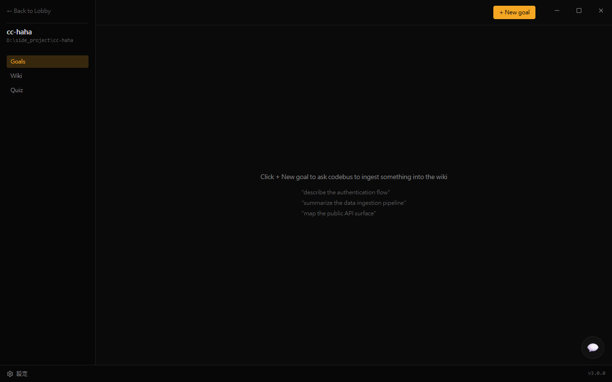

Sidebar render across all Workspace screens — the structure is identical
in every Workspace screenshot below.

**Aligned:** 200px width, vault block (name 14/600, mono path), three nav
rows, gear footer entry (currently rendered via shared `BottomStrip`, not
the sidebar; see below).

**Gaps:**

- **S1. `← Back to Lobby` hard-coded English** (and overly verbose). Will
  become `← 返回` — the word "Lobby" never appears anywhere else in UI,
  so users have no anchor to learn it.
- **S2. Vault block top/bottom dividers invisible** (C4).
- **S3. Section label "VAULT" — we're dropping it entirely.** Only one
  nav group exists; the section label adds visual noise, not structure.
  And the word "Vault" is being removed from UI anyway (see 04a).
- **S4. Nav rows missing emoji prefix.** Spec calls for 🚏 Goals / 📂 Wiki
  / 🎓 Quiz. We render plain text.
- **S5. Nav rows missing right-side mono count.** Spec shows `12` / `38`
  / `12`. Useful for "I have 0 quizzes vs 30 quizzes" awareness; empty
  state shows `0` which is informational.
- **S6. Active row missing left 2px amber bar (`left: -6px`).** Currently
  the active row is just an amber tint fill. The amber bar is the Linear
  signature affordance — we'd like to land it.
- **S7. Sidebar bottom slot missing.** Spec puts settings icon + refresh
  icon + `⌘K` chip at the sidebar bottom. We have:
  - Settings → currently in a shared `BottomStrip` at app bottom (the
    `⚙ 設定` link at bottom-left across all screens).
  - Refresh → we don't need this; codebus has a file watcher that picks
    up external changes automatically. We're dropping refresh.
  - `⌘K` chip → deferred until ChatWidget integration is finalized (see
    decision below — we cut 05 Cmd+K Overlay, but `⌘K` toggles
    ChatWidget).
  Plan: move settings to sidebar bottom, drop refresh, defer `⌘K`
  chip. Then the `BottomStrip` becomes Lobby-only (or gets removed
  entirely if we put the version somewhere else).

#### Goals overview · Empty

(Same screenshot as above; Goals is the default tab.)

**Spec gray area** — the Goals empty state isn't explicitly designed.
We're going to model it after 04b Lobby empty: small hero (🎯 lucide
`Target` icon, 40px), h-empty title, subtitle, then keep the three
example goal prompts as amber mono pills (clickable to prefill
NewGoalModal). The current rendering puts the three examples as plain
quoted text in the vertical center, with no header row and no anchor
title.

**Gaps:**

- **R1. Topbar bottom border invisible** (C4).
- **R2. Missing content header row.** Spec has `<h1>Goals</h1>` +
  subtitle + `[+ New Goal]` CTA + `N` shortcut chip in the content
  header. We jump straight to the empty hint.
- **R3. Empty state philosophy.** We're going to align with the 04b
  Lobby pattern (hero + subtitle + CTA + supporting card). Currently
  it's a minimal three-line hint, which feels under-designed compared
  to Lobby and undermines the "first thing users see in a vault"
  importance.
- **R4. Example prompts are hard-coded English** ("describe the
  authentication flow", "summarize the data ingestion pipeline", "map
  the public API surface"). They should be Chinese in zh, and rendered
  as clickable amber pills (prefill NewGoalModal on click).
- **R5. Content vertically dead-centered** — same as G1.
- **R6. `+ New goal` CTA in topbar.** Per C7, will move into content
  header.

#### Goals overview · Populated

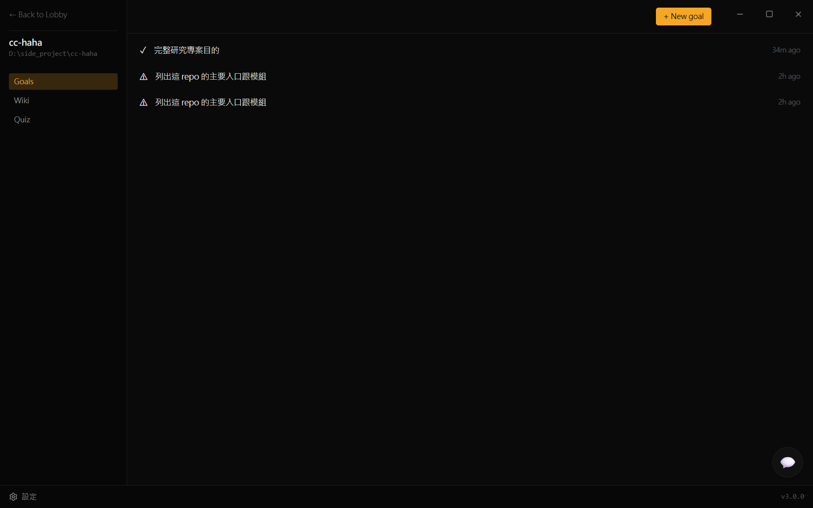

This vault has three goals: one done, two interrupted. Compared to spec
6-row table.

**Gaps:**

- **GP1. Missing content header row.** Same as R2.
- **GP2. `+ New goal` CTA placement.** Same as R6.
- **GP3. Missing `RECENT` section label + count** (e.g. `3 of 3` mono).
- **GP4. Goal table has no card wrapper.** Spec puts the rows in a
  `bg-raised` card with border. We render rows directly on background.
- **GP5. Status indicator inconsistent with the three-state system** (see
  C5). Currently: done = white ✓, interrupted = amber ⚠. Going to:
  - done = green 7px dot
  - interrupted = amber 7px dot
  - failed = red 7px dot
- **GP6. Missing kebab + hover affordance.** Users can't retry / remove a
  single goal from the list.
- **GP7. Time-ago strings hard-coded English** (`34m ago`, `2h ago`).
  We have `common.minutesAgo` etc. i18n keys; just need to use them.
- **GP8. Running row not expanded.** Spec calls for the running row
  to be ~52px tall, showing a mono 11.5px "stream tail" (current
  narration) with amber blinking caret, plus `streaming · 4,218 tok`
  on the right. Currently a running row looks like any other row;
  users have no ambient awareness of goal progress without entering
  the detail view.

(`GP9: duplicate goals` — we have two identical-titled rows; not
treating as a bug, dedup behavior is a future decision.)

#### ChatWidget

(Floating bubble visible in bottom-right of every Workspace screenshot.)

**Spec gray area.** ChatWidget isn't in the v1 spec; we added it during
v3 to surface multi-turn AI Q&A and the "promote chat → goal" workflow.

The ChatWidget design conversation prompted us to revisit 05 Cmd+K
Overlay — see decision log at the end.

**Gaps:**

- **R7-1. `💬` emoji is the only cartoon element left.** Replacing with
  `lucide MessageSquare`.
- **R7-2. Collapsed bubble overlaps Goal Cancel button** (see C6).
- **R7-3. ChatWidget i18n** — Cat C (`Open chat`, `Resize chat widget`,
  `Minimize chat`, `Drag to resize`) all hard-coded.

### 02 · Goal Detail

#### Philosophy: timeline vs flat feed

Spec describes a **timeline** structure: two collapsible sections
(`READING CODEBASE`, `WRITING WIKI`) with a 1px-left-border guide and
8px tick marks, plus a bottom collapsible stream log card. Each
section is meant to group tool calls semantically.

We landed a **flat activity feed with emoji banners**:
🚌 (boarding) → 🎯 (goal banner) → 🤔 (thought block) → 🔧 (tool call)
→ 🛡 (PII summary) → 🔍 (lint start/done) → 🚏 (commit) → 🎉 (done).
The banner emoji are deliberately on-brand (bus metaphor) and feel
warmer than the spec's IDE-style structure.

Both philosophies have merit. Our hybrid plan:

- Keep the brand banner emoji — they're the most distinctively codebus
  thing in the activity stream.
- Add visual grouping by tool kind (Read/Glob/Grep cluster,
  Write/Edit cluster, Shell cluster) with the spec's 1px-left-border
  guide.
- Extract the raw event log into a `<CollapsibleStreamLog>` component
  with timestamps + color-coded tags, closed by default, used across
  02a / 02b / 02c.

#### 02a · Running

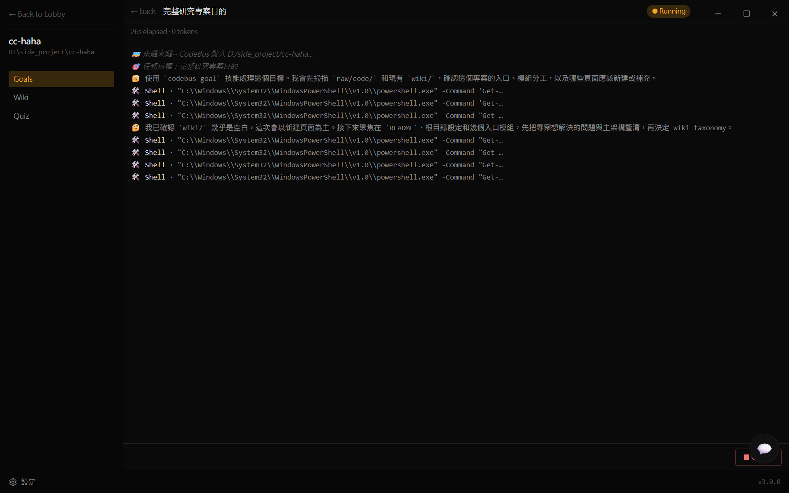

The R7-2 ChatWidget/Cancel collision is visible in the bottom-right
corner of this screenshot.

**Gaps:**

- **W2. Back link layout wrong.** Spec puts `← Goals` on its own line
  *above* the title (font-size 12, fg-tertiary). We render `← back`
  inline with the title.
- **W3. Status line layout completely wrong.** Spec puts amber pulsing
  dot + amber `Running` + mono `23s · 8.2k tokens` + danger Cancel
  button all in the title row right side. We render: dot + Running in
  topbar right, elapsed/tokens on a separate left-aligned row below
  the title, and Cancel in a footer at the bottom right (the source
  of the ChatWidget collision). Fixing W3 also fixes C6.
- **W4. Activity stream has no visual grouping.** See the philosophy
  discussion above.
- **W5. No live "stream tail" / spinning indicator.** Spec calls for
  the bottom-most live row to show a spinning circle + amber narration
  + blinking caret. We render the last event the same as historical
  events.
- **W6. No collapsible stream log card.** Spec puts a `closed by
  default` raw-events card at the bottom with 11.5px mono +
  `00:00.142` timestamps + color-coded `goal`/`plan`/`read`/`write`
  tags. We don't have this at all in 02a — only on 02b/02c (and
  there it's `open` by default; see D3).
- **W7. Shell tool row unreadable due to PowerShell wrapper** (see C8).
- **W10. `← back` text hard-coded** — should become `← 返回 Goals` /
  `← Goals`.

#### 02b · Done

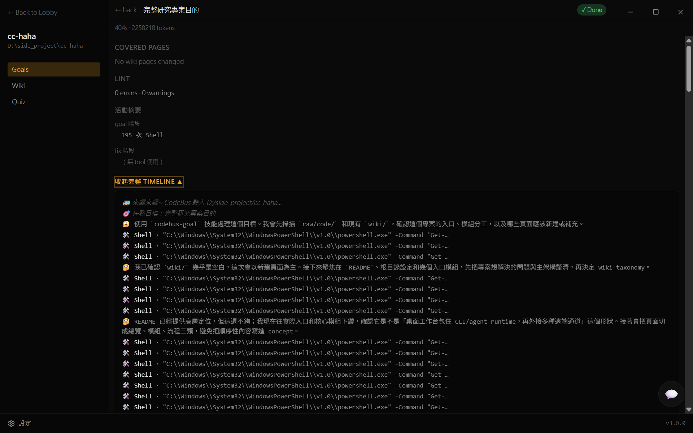

Note: this run produced zero wiki changes (it was a research-only goal),
so the "WIKI PAGES CHANGED" card has nothing to render. The "注意事項"
(Follow-ups) section is codebus-specific (LLM-authored next-step notes
for the user).

**Gaps:**

- **D1. Section labels (`COVERED PAGES`, `LINT`) hard-coded English.**
  See C3 for the CJK uppercase-tracked problem; these need a unified
  alternative.
- **D2. "注意事項" section is a gray area** — it's a codebus-only
  feature (LLM follow-up notes). Keeping it; aligning visually with
  the other micro-label sections.
- **D3. TIMELINE card is open by default.** Spec says "closed by
  default". Currently users land on 02b and see a giant scroll of
  raw events. Will close by default; users can expand if they want
  the raw log.
- **D4. Section name `COVERED PAGES` vs spec `WIKI PAGES CHANGED`.**
  We're switching to spec wording — "changed" is the user-facing
  verb that matches what the section actually shows (pages this goal
  modified, not pages it referenced).

#### 02c · Interrupted (design gray area)

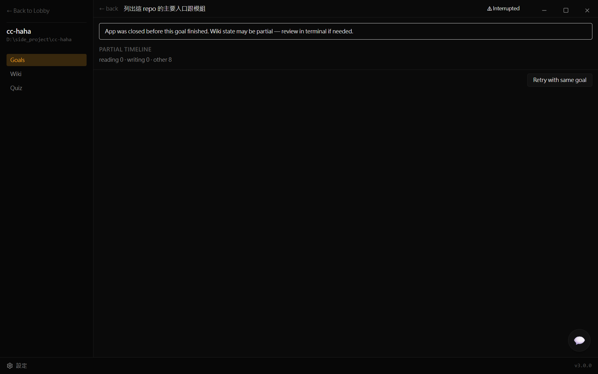

**Not in spec.** Goals can be interrupted three ways: user cancels mid-run,
app is closed before finish, or the LLM run dies (network drop, codex
sandbox crash). All three currently route to this view (`RunDetailCancelled.tsx`,
slightly misnamed for what it actually handles).

**Aligned (against our own internal sense):** amber `Interrupted` pill,
amber-bordered notice banner, `PARTIAL TIMELINE` mini-summary, prominent
Retry button.

**Gaps:**

- **I1. Notice banner copy is English + uses CLI-speak.** "App was closed
  before this goal finished. Wiki state may be partial — review in
  terminal if needed." The "review in terminal" phrasing is wrong for
  a GUI-first app — users have no reason to open a terminal. Will
  become: "app 中途被關閉，wiki 內容可能不完整。需要的話可以重跑這個
  goal。" (or similar — copy not final.)
- **I2. `PARTIAL TIMELINE` is just a count summary.** No way to see what
  the goal actually did before it died. Hard to make a retry decision
  without that context. Will add the same `<CollapsibleStreamLog>`
  used in 02a/02b.
- **I3. `PARTIAL TIMELINE` label needs CJK treatment** (C3).
- **I4. Retry button location.** Currently floats in the right-mid of
  the content area. Spec convention (where it has one) puts actions
  in the header right; we'll move it next to the Interrupted pill.

**Question for design:** does the spec want to formally take a position
on this third state, or is it OK as a codebus extension?

#### LoadingOverlay (vault init)

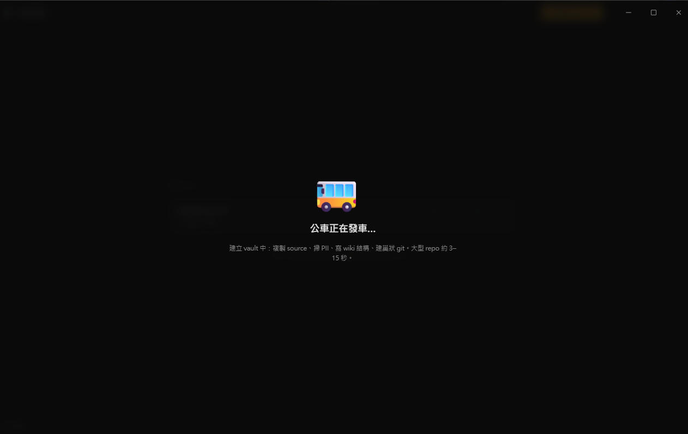

**Not in spec.** Shown during the heavy `addVault` init path (~3–15s for
small repos, longer for big ones). Backdrop blurs the Lobby underneath;
72px 🚌 emoji animates via a custom `codebus-bus-roll` keyframes
(translate -26→12px X, slight Y bob, ±2° rotation), 1.8s loop.

**Aligned (against our own design sense):** the bus-roll animation is
on-brand and we like it. Best surface for the public bus metaphor.

**Gaps:**

- **LO-1. Subtitle leaks implementation jargon.** "建立 vault 中：複製
  source、掃 PII、寫 wiki 結構、建巢狀 git。" — "掃 PII" reads as
  "we scanned your PII" instead of "we scrubbed PII from source we
  copied", and most users don't know what nested git means here.
- **LO-2. Title "公車正在發車…" — we'd like to revisit copy.**
  Candidates: "準備出發…", "上車中…", "司機暖車中…". No final pick yet.
- **LO-3. Bus motion vocabulary across the app.**
  - LoadingOverlay = "actually moving forward" (translate + rotate +
    bob)
  - We'd like the 04b empty hero to be "idling in place" (small
    vertical bob, no translate).
  - These are different bus moods; we'd like to make sure design
    blesses the distinction before we lock multiple animations in.
- **LO-4. Subtitle should become live progress.** The init backend
  (`codebus-core/src/vault/init.rs`) already emits ~20 typed
  `InitEvent`s; the Tauri layer currently discards them
  (`on_event = |_| {}`). With ~6 reasonable groupings (prep → copy +
  PII scan → nested git → wiki scaffold → Obsidian register → final
  checks), we can replace the static enumeration with live step
  messages. Engineering work, not a design ask — but it'd let us
  rewrite the subtitle as a coachable sequence instead of an info dump.

### Wiki Tab (design gray area)

Spec explicitly notes: *"the wiki page reader is a future screen, not yet
shown."* We've built it; below are the three surfaces.

#### Tree view (page selected)

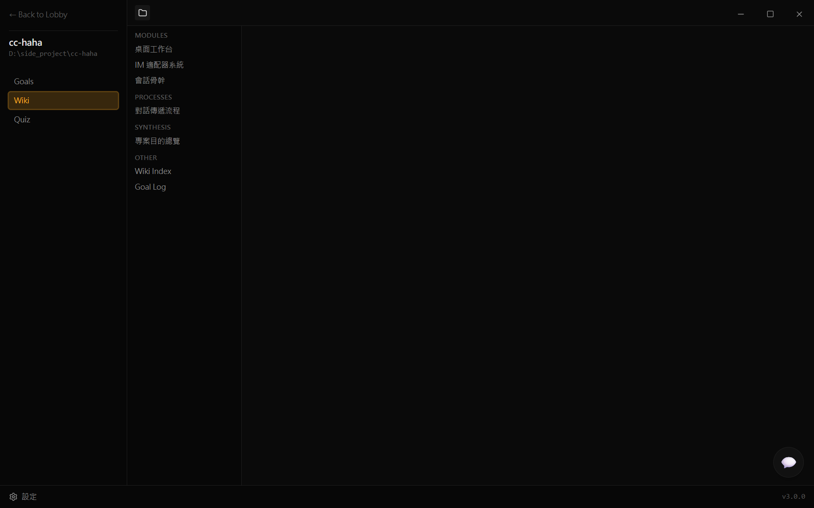

Three-column layout: 200px sidebar + ~240px wiki tree + remaining
preview. The vault has 5 pages distributed across the spec's 5-bucket
taxonomy (concepts / entities / modules / processes / synthesis), but
this vault only has modules + processes + synthesis populated. Plus
`OTHER` containing system pages (`Wiki Index`, `Goal Log`).

**Gaps:**

- **WK1. Section labels (`MODULES`, `PROCESSES`, `SYNTHESIS`, `OTHER`)
  uppercase English** — CJK treatment problem (C3). Easier here than
  elsewhere because these aren't user-translatable (they're the spec's
  5-bucket taxonomy names); we could keep them English.
- **WK2. `OTHER` bucket name is too vague.** Going to dissolve it:
  promote `Wiki Index` to the top of the tree (the natural home for
  vault-wide entry), move `Goal Log` to a footer slot in the tree
  (it's a system-authored log, not really a wiki page).
- **WK4. Empty buckets don't render.** This is `concepts` and `entities`
  missing here because the vault has no pages in those buckets. We
  believe this is by design (don't clutter the tree with empty
  groups) — please confirm.
- **WK5. Tree rows have no visual cue for bucket type.** All page rows
  are plain text. We're considering a lucide icon prefix per bucket:
  `Lightbulb` (concept), `Box` (entity), `Blocks` (module), `Repeat`
  (process), `Link` (synthesis). Avoiding emoji to stay in the
  Linear-tight aesthetic.
- **WK6. Column borders invisible** (C4).
- **WK7. "Wiki Index" / "Goal Log" system-page names.**
  - `Wiki Index` → translating to "Wiki 索引"
  - `Goal Log` → translating to "旅行日誌" (echoes the README brand
    `log.md` 旅行日誌)
- **WK8. The folder icon at the tree top is the tree toggle button**
  (`lucide Folder`, `aria-label="Toggle Pages tree"`). Functional, but
  it's unobvious from the visual — could use a clearer affordance or
  a label.

#### Page preview

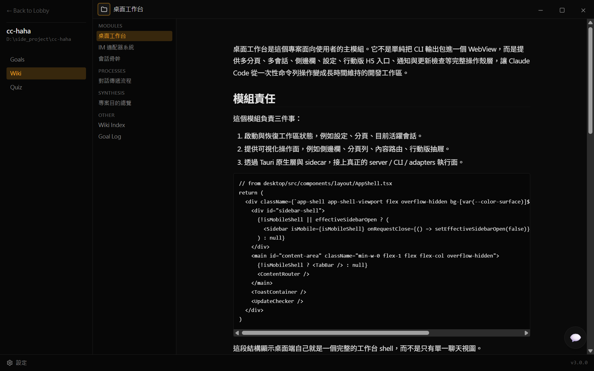
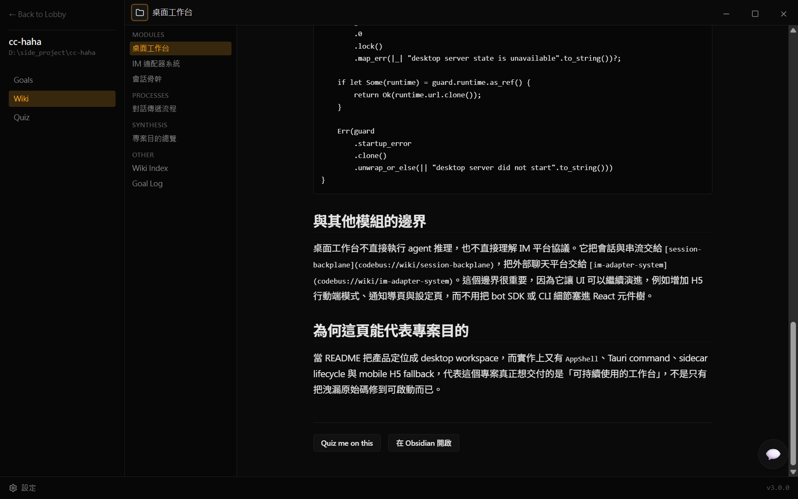

Milkdown-rendered markdown; wikilinks resolve via custom `codebus://wiki/<slug>`
scheme. Bottom buttons: `Quiz me on this` and `在 Obsidian 開啟`.

**Gaps:**

- **WP2. No page metadata bar.** Users want to know who/when wrote this
  page. We're going to add a small mono row at the top with last-update
  goal name + relative time.
- **WP5. No edit / regenerate action.** This is intentional — codebus's
  position is that humans edit wiki by running a new goal that
  describes the desired change, not by direct edit. But we should
  surface this somewhere ("don't like this page? run a goal to
  rewrite it") instead of leaving users to guess.
- **WP10. "Quiz me on this" should be amber tint.** Spec note in 02b
  Done says wiki pages with quizzes should highlight the Quiz me
  CTA in amber. The button here renders as plain secondary.
- **WP11. Wikilink styling.** Spec 03b citation calls for
  "dashed-underline mono wikilink in amber". Spec doesn't specify
  the same for *non-citation* wikilinks. Our view: wiki-internal
  wikilinks should be plain underline (amber on hover) — keep the
  dashed-amber style as the citation-specific marker for
  Quiz Reviewing. Confirming.
- **WP13. Wikilinks use `codebus://wiki/<path>` scheme, not
  Obsidian-style `[[slug]]`.** README claims Obsidian-compatibility;
  we need to verify that Obsidian itself can follow these links
  (worst case: codebus app reads `codebus://` and writes `[[slug]]`
  on the filesystem). Engineering verification, not a design ask.

#### Wiki empty (vault has no pages)

(`WikiTab.tsx:50–64` — no screenshot since the test vault has pages.
The render is just one line, centered, mid-gray:
`No wiki pages yet — run a goal to start documenting`.)

**Gaps:**

- **WK-EMPTY-1. Severely under-designed compared to 04b Lobby empty.**
  Will redo with a `lucide Folder` 56px hero, h-empty title,
  subtitle, and an amber `→ 跳到 Goals` CTA that switches the tab.
- **WK-EMPTY-2. Hard-coded English** (Cat B).
- **WK-EMPTY-3. No CTA / dead-end.** Users in an empty wiki have
  nowhere obvious to go — we'll add the tab-switch CTA.

### 03 · Quiz

Spec covers 03a Pending and 03b Reviewing (the per-question views).
The Quiz flow is *actually* a multi-step wizard:

1. Click `+ New quiz`
2. Enter topic + Start
3. LLM plans which wiki pages to use
4. **Scope confirmation step** — user approves the picked pages
5. LLM generates questions
6. 03a Pending → answer
7. 03b Reviewing → see feedback
8. Loop 6+7 for remaining questions
9. Completion summary
10. Return to history list; row clickable for re-review

Steps 1, 3–5, 9, 10 are all out-of-spec.

#### Quiz history · Empty

**Gaps:**

- **QE1. Header is plain `Quiz history`.** Will become `Quiz` h1 +
  subtitle "驗證自己有沒有看懂 wiki" (echoes Lobby step 3 copy).
- **QE2. Empty hint hard-coded English** (Cat B).
- **QE3. Empty state under-designed** — same R3 pattern. Will add
  `lucide GraduationCap` hero + subtitle + content-area CTA.
- **QE4. `+ New quiz` CTA in topbar.** Same as C7.

#### Quiz wizard — flow problem

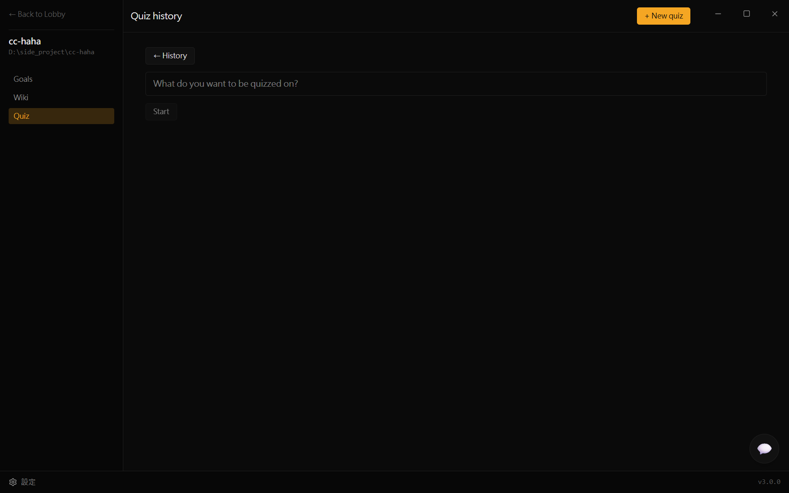

This screenshot is taken right after pressing `+ New quiz`. Two problems
are immediately visible:

1. **`+ New quiz` CTA is still present in the topbar**, even though we're
   now inside the new-quiz flow. Users wonder "I just pressed that —
   what happens if I press it again?"
2. **Header still reads `Quiz history`**, not reflecting that we're in
   a different state.

Then the rest of the wizard renders inline:

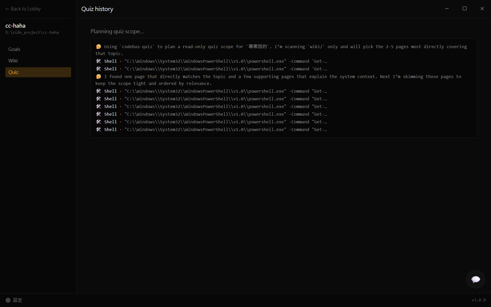
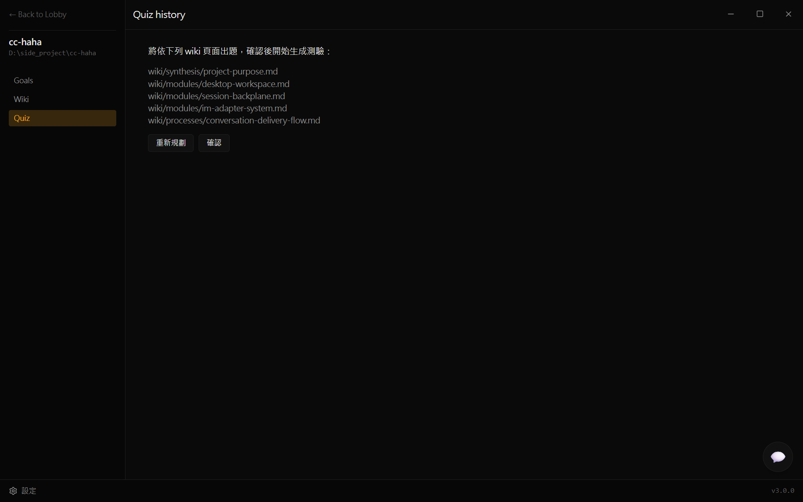

Comparing to how `+ New goal` works: that opens `NewGoalModal.tsx` and
is gone immediately on submit/cancel. We initially considered making
Quiz match (modal pattern) but realized halfway through this audit:

- Goal flow = one-shot (modal-shaped)
- Quiz flow = 6-step wizard (modal-shaped is wrong for this)

**Decision:** Quiz becomes a fullscreen wizard view (entered like
GoalDetail). The topbar `+ New quiz` hides; the header shows the
current step ("New quiz · Step 2/4 · Scope"); Cancel returns to
history. This sidesteps the "button-pressed-but-still-there" confusion
and gives the wizard the surface area it needs for its multi-step
nature.

**Question for design:** is this an acceptable departure from the
spec's flat-tab layout, given the multi-step nature of the flow?

#### 03 — generation log specific gaps

(Same activity-stream pattern as Goal Running, with these differences:)

- **QG5. No Cancel button** during quiz generation. Users have no way
  to abort mid-generation if they typo'd the topic. Adding header-right
  Cancel to match Goal Running.
- **QG6. No elapsed / tokens counter.** Adding to match Goal Running.
- **QG7. No opening brand banner.** Goal Running opens with "🚌 來囉
  來囉~ CodeBus 駛入 …" + "🎯 任務目標：…". Quiz starts cold with a
  thought block. Considering adding "🎓 quiz 主題：…" as the equivalent
  brand banner — brand consistency, plus users see the topic confirmed
  at the top.
- **QGEN1. Internal marker tag leaks to user.** A thought block reads:
  `🤔 [CODEBUS_QUIZ_NO_VALIDATE] codex sandbox cannot run quiz structure
  validation`. The all-caps bracketed token is internal signal we
  should detect and either filter or rewrite for users.

#### 03a · Pending

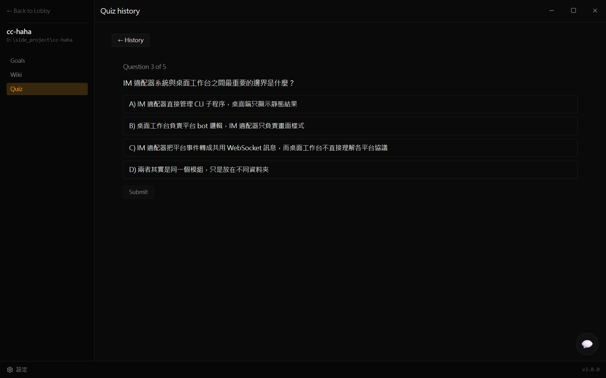

**Gaps:**

- **QA1. Header doesn't reflect quiz scope.** Spec shows `Quiz: <scope>`
  (mono) on the left, `Q3 of 5` counter on the right of the header
  strip. We just show `Quiz history`.
- **QA2. "Question 1 of 5" rendered in content area, English, full
  prose.** Will move to header right per spec, shorten to `Q1 of 5`,
  translate.
- **QA3. Question text missing mono `Q1.` prefix** (spec: dim 18/500
  mono + question 22/600 sans).
- **QA4. Choice rows missing letter chip + radio circle.** Spec:
  `[A] (10/mono boxed key) · radio · label · optional tag`. We render
  `A)/B)/C)/D)` inline with the choice text and no radio. The boxed
  letter chip is part of the keyboard-shortcut affordance.
- **QP3. Missing `⏎ to submit` keyboard hint** in the footer.

#### 03b · Reviewing — Correct answer

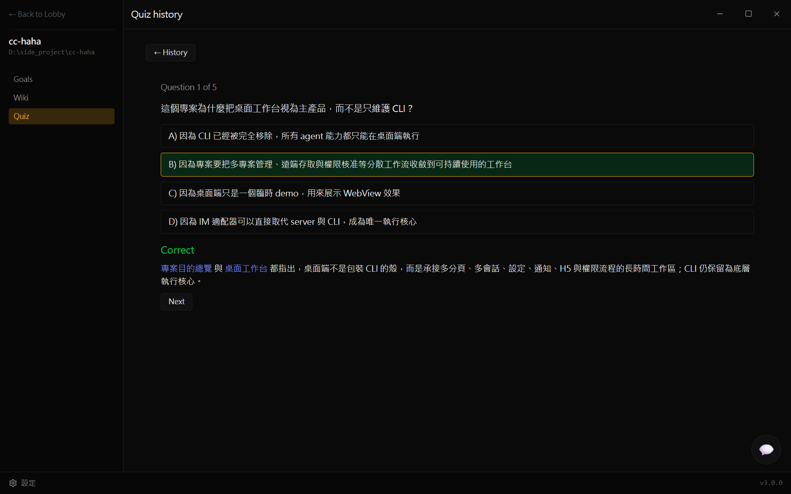

**Gaps:**

- All the QA1–QA4 layout issues carry over.
- **QA5. Other (non-selected, non-correct) choices don't fade to 55%
  opacity** per spec.
- **QA-WRONG-1. Missing inline `correct` / `your answer` tags.** Spec
  has small tags next to the radio (`correct` green / `your answer`
  red). We compensate with a large "Correct" / "Incorrect" headline,
  which works but isn't to spec.
- **QA6. Explanation is NOT the citation blockquote.** Spec calls for
  "2px amber left border, bg-raised fill, amber `"` opening glyph,
  cited quote, dashed-underline mono wikilink in amber". We render
  plain prose + inline normal links. This is the single biggest
  visual miss in the Quiz section.
- **QA7. Wikilinks are plain underline, not amber dashed mono** (see
  WP11 — we want to scope the amber-dashed style to *citation*
  wikilinks specifically; non-citation wiki internal links stay plain).
- **QA8. Footer missing `← Back to wiki page` link + `Next: Qn →`
  styling.** We have a plain `Next` button only.
- **QA9. Missing `→ to advance` keyboard hint.**

#### 03b · Reviewing — Wrong answer

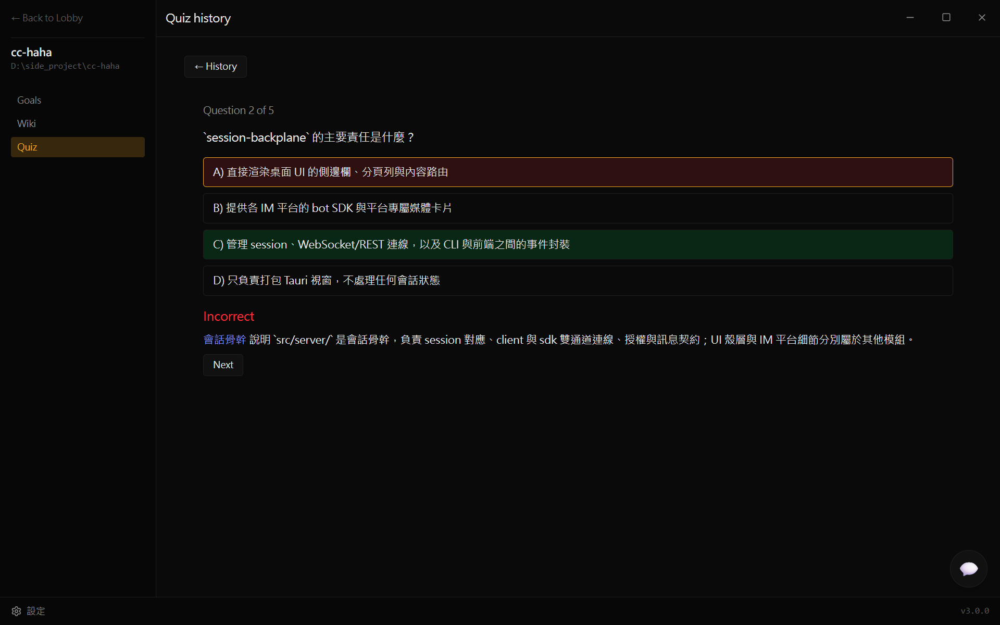

Same gaps as the correct-answer case; this one also shows what the
wrong-pick rendering looks like (red border on selected wrong row,
green border on correct row). The non-selected non-correct choices
visibly DON'T fade (QA5).

#### Quiz completion summary (gray area)

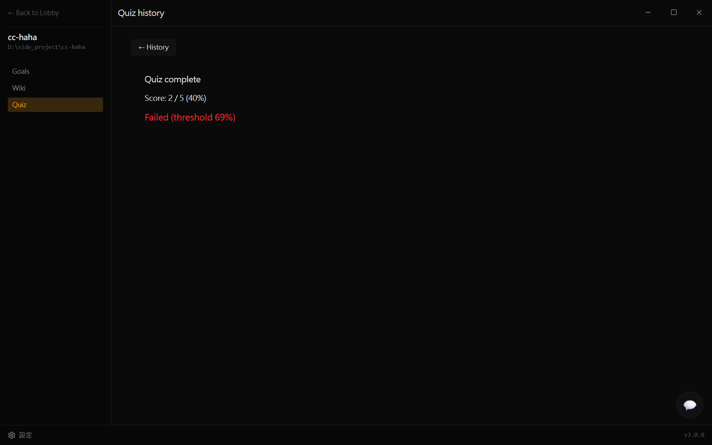

**Spec gray area.** What users see after answering question 5.

**Gaps:**

- **QF1. Severely under-designed.** Three lines of plain text. Will
  redo with hero icon (`lucide CheckCircle2` pass / `XCircle` fail),
  h-empty title ("通過了 (88%)" / "沒通過 (40%)"), subtitle, and
  three action buttons: amber `重做此份` + secondary `看錯題` +
  `回 history`.
- **QF2. "Failed (threshold 69%)" hard-coded English** (Cat B).
- **QF3. No actions** — currently a dead end; user must click `← History`
  to leave.

#### Quiz history (populated)

**Gaps:**

- **QL1. Row title is the internal hash ID `topic-a7fb67fc`, not the
  user's topic `專案目的`.** This is a real UX bug — users can't
  recognize their own quizzes in the list. The topic is shown in the
  subtitle row; should be swapped to be the title.
- **QL2. Timestamp is raw ISO** (`2026-05-25T16-53-17Z`). Will use
  the existing relative-time keys: `34 分鐘前`.
- **QL3. Result `fail` is English + uncolored.** Will become a colored
  pill (red for fail, green for pass) per C5 status tokens.
- **QL4. "5/5" is unclear** — it's "5 of 5 answered", but next to "40%"
  and "fail" it's confusing what's a score vs what's a count. Considering
  restructuring as "2 / 5 答對 · fail" (drop the answered count once we
  guarantee all quizzes get answered to the end).
- **QL5. No hover kebab.** Same as GP6 / vault card kebab — need
  a discoverable per-row menu (delete attempt, view, retry).
- **QL6. `+ New quiz` CTA in topbar** (C7).

#### Quiz review-all (codebus addition)

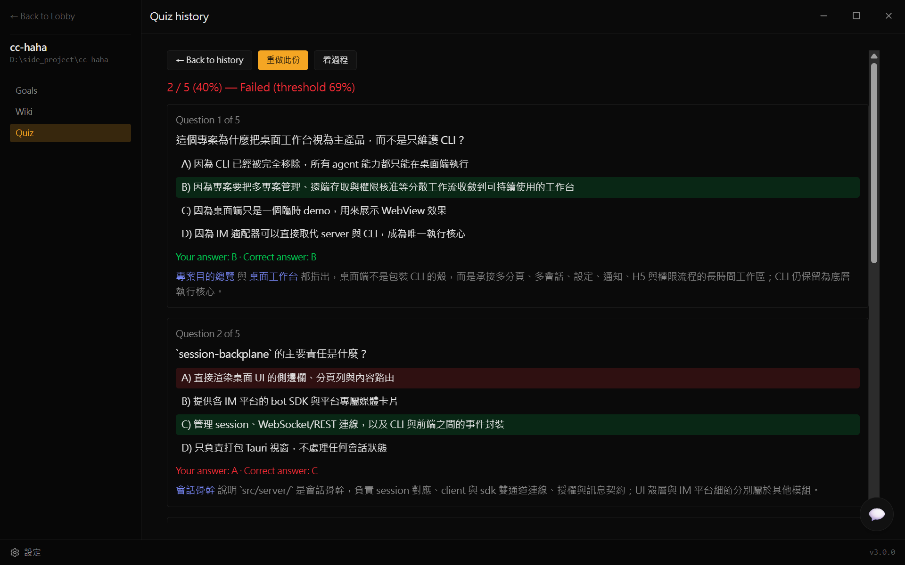

**Spec gray area, but we like this.** Clicking a quiz in the history
list opens a full-page review showing every question + correct/wrong +
explanations in sequence. Lets users post-mortem an entire quiz at
once. Worth keeping.

**Gaps:**

- **QR2. Header actions mix languages.** `← Back to history` (English)
  next to `重做此份` (Chinese) and `看過程` (Chinese). All English →
  Chinese for non-jargon labels. Also `看過程` is opaque — what process?
  Probably the generation log. Renaming to "看 quiz 怎麼生的" or
  similar.
- **QR3. "Your answer / Correct answer" hard-coded English** (Cat B).
- **QR5. "← Back to history" hard-coded English** (Cat B).
- **QR6. Visual separation between questions is weak.** Adjacent
  questions blend together; will add a hairline or larger gap.

### 06 · Settings Modal

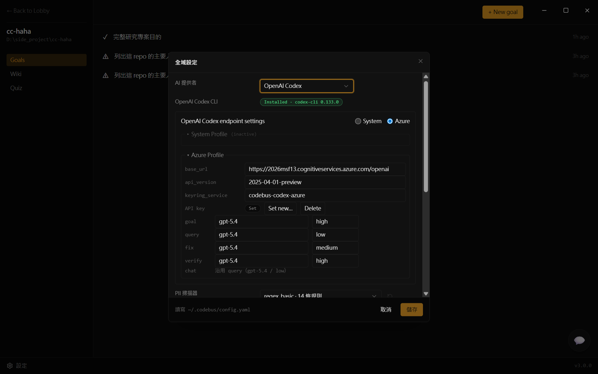
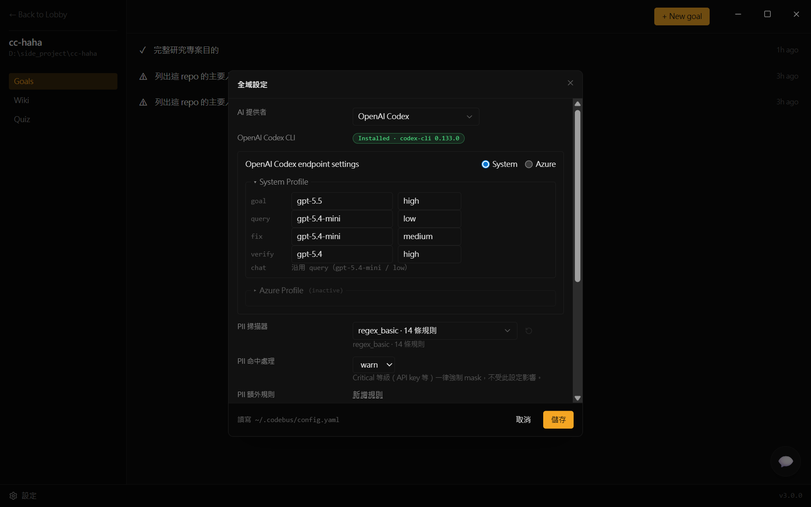
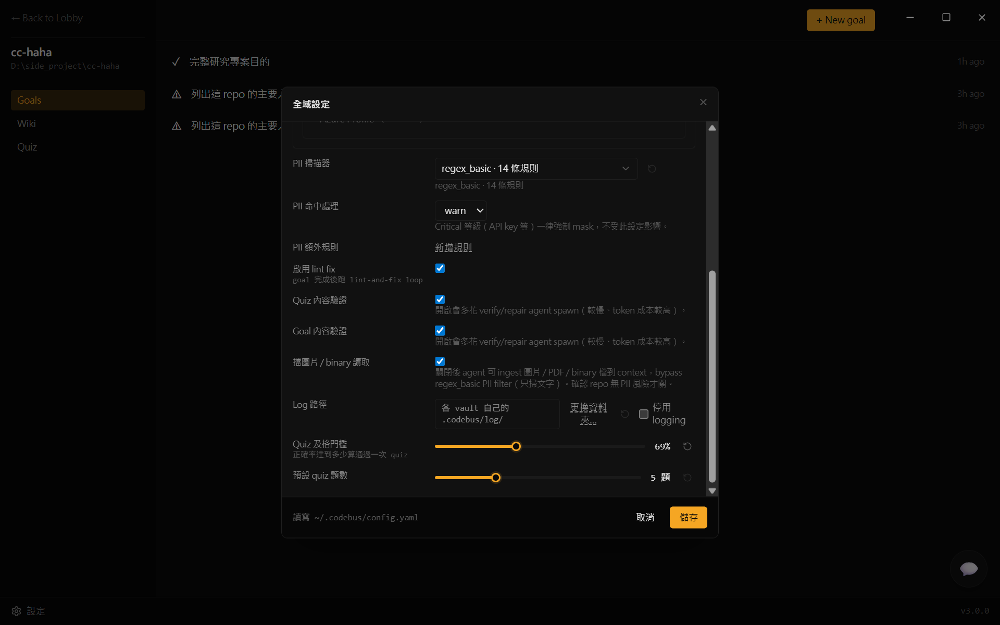

The modal frame, PII section, behavior toggles, log path, and quiz
limit sliders are i18n-complete. The endpoint subcomponents
(EndpointSection, CodexEndpointSection, SetKeyDialog) and the
"Installed · codex-cli 0.133.0" badge are fully English. That's the
Cat A i18n hole from C2 — entirely contained in three files.

**No layout gaps.** The modal isn't specced in detail, and the
existing layout is reasonable (single long form, no section tabs).
We're noting two small things to keep an eye on:

- **ST7. PII scanner dropdown has a redundant helper line.** The
  dropdown reads `regex_basic · 14 條規則` and the helper text below
  reads the same. We'll either remove the helper or rewrite it to
  describe what the scanner actually does ("covers email / API key /
  IP / 14 patterns total").
- **ST10. "擋圖片 / binary 讀取" label is reverse-polarity to its
  hint.** Toggle on = block reading; the hint reads "關閉後 agent 可
  ingest…". Going to flip the label to "允許讀取圖片 / binary" so
  toggle-on = allow, matching the hint phrasing.

We may eventually want section tabs (Provider / Privacy / Behavior /
Quiz) if more settings get added, but not yet.

---

## Decision Log

### CUT: 05 Cmd+K Overlay

We're not implementing 05. Reasons:

- No UI in the app ever surfaces its existence — users wouldn't miss it.
- 100% of its functional value (Q&A against the wiki with citations) is
  already in ChatWidget.
- ChatWidget provides everything 05 has *plus* multi-turn, "promote
  chat to goal", token counter, undo. Maintaining two chat-like
  surfaces is long-term overhead.

`Cmd+K` (Ctrl+K on Windows) currently toggles ChatWidget expand/collapse;
keeping that.

If we ever want the "centered modal spotlight" *form factor*, the right
move is to add a centered-modal mode to ChatWidget (proposed but not
scheduled) rather than build a separate component. The spotlight
form is a presentation choice on the same backend, not a separate
feature.

The 05 spec files (`design_files/components/cmdk-overlay.jsx`,
`README.md` section 05) stay in the repo for reference — useful pattern
documentation.

### Vault terminology: removed from UI

`Vault` was Obsidian carry-over. We changed:

- `+ 新增 Vault` → `+ 新增`
- `近期 VAULT` (mixed-case bug too) → `最近`
- "...就能開啟成新 vault" → "...就能加入清單"

CLI / config / data model (`VaultEntry`) keep the word. Internal docs
keep the word. Just gone from the user-facing UI.

### Goal vs Quiz launch patterns

- Goal: modal (one-shot) — keep as is.
- Quiz: fullscreen wizard view (multi-step) — new.

The earlier instinct to align both on one pattern was wrong — the flows
are different shapes.

### Status indicator: three states

- `done` → green
- `interrupted` → amber (codebus extension; not in spec)
- `failed` → red

See C5.

### Reserved English jargon

Tab labels (`Goals` / `Wiki` / `Quiz`), CLI verb names, Codex effort
values, PII action enum, config YAML keys. Everything else translates.

---

## Open Questions for Design

These are decisions we're holding off on until we hear from you:

1. **CJK section-label affordance** (C3). What's the right substitute
   for uppercase-tracked treatment in zh-tw? Options we're weighing:
   amber left bar, small box outline, dot prefix, or just drop the
   label when only one group exists.

2. **02c Interrupted** — is this a state worth absorbing into the spec,
   or stays codebus-extension?

3. **Quiz wizard form factor** — fullscreen wizard view (departing from
   the flat-tab layout of 03a/03b) acceptable for the multi-step flow?

4. **Step indicator visual for the Quiz wizard** — header text
   ("Step 2/4 · Scope"), progress dots, or something else?

5. **Bus motion vocabulary**:
   - LoadingOverlay: "actually moving forward" (current
     `codebus-bus-roll` keyframes)
   - 04b empty hero: "idling in place" (proposed, small bob)
   - Anywhere else? We don't want the bus to over-animate.

6. **Wiki tree page-type icons** — `lucide` icons (Lightbulb / Box /
   Blocks / Repeat / Link) per bucket, or stay icon-less?

7. **Quiz citation wikilink vs wiki-internal wikilink** — confirm
   the dashed-amber-mono treatment is citation-specific and
   wiki-internal links stay plain?

8. **Quiz completion summary** — your take on the proposed redesign
   (hero icon + h-empty title + subtitle + three actions)?

9. **`Goal Log` translation** — we're going with "旅行日誌" to echo
   the README brand. Sound right?

10. **Page metadata on wiki preview** — proposed mono-row at top
    ("Last updated by goal '…' · 12h ago"). Layout / position
    suggestions?

---

## Appendix: Files We Touch

Implementation references for each gap class:

- **Cross-cutting i18n Cat A**:
  `src/components/settings/EndpointSection.tsx`,
  `CodexEndpointSection.tsx`, `SetKeyDialog.tsx`
- **Cross-cutting i18n Cat B**: see individual screen sections —
  `QuizAnswering`, `QuizReview`, `QuizTab`, `NewGoalModal`, `ChatInput`,
  `GoalsTab`, plus the `← back` button strings in multiple components
- **Cross-cutting i18n Cat C**: `ui/dialog.tsx`, `ChatWidget.tsx`,
  `WikiTab.tsx`, three `title="Page not found"` instances
- **Typography**: `tailwind.config.ts` / `styles/globals.css` token
  layer, plus any hard-coded `text-[Npx]` usages
- **Border contrast**: same token layer (`--border` /
  `--border-strong`)
- **Status tokens**: `--success` / `--warn` / `--error` plus pill
  components in Goals list, Goal Detail header, Quiz history
- **`<CollapsibleStreamLog>`**: new component, replaces inline raw
  logs in `RunDetailRunning` / `RunDetailDone` / `RunDetailCancelled`
- **Shell wrapper extraction**: `ActivityStreamItem.tsx`
  `summarizeToolInput`
- **ChatWidget icon**: `ChatWidget.tsx` (`💬` → `lucide MessageSquare`)
- **Quiz wizard view**: new component(s) replacing the inline
  state-switch in `QuizTab.tsx`
- **Loading overlay progress**: `vault_list.rs` Tauri layer (currently
  `on_event = |_| {}`) → emit `vault-init-progress` events;
  `LoadingOverlay.tsx` subscribe + show live step

---

*End of feedback document. Internal Mandarin notes with finer-grained
IDs live in `AUDIT.md` next to this file.*
