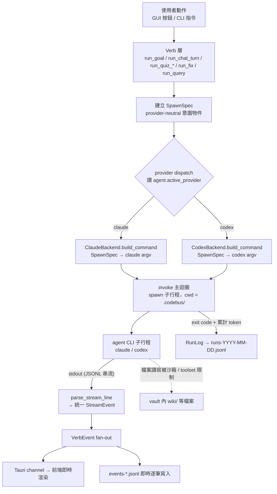
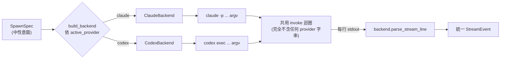
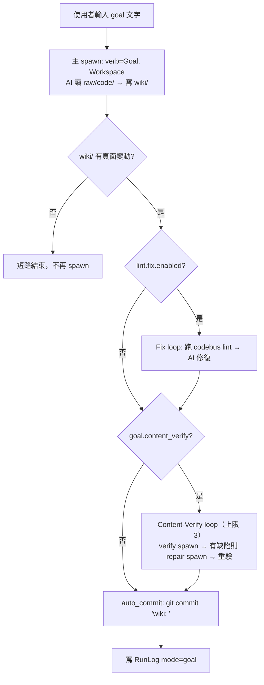
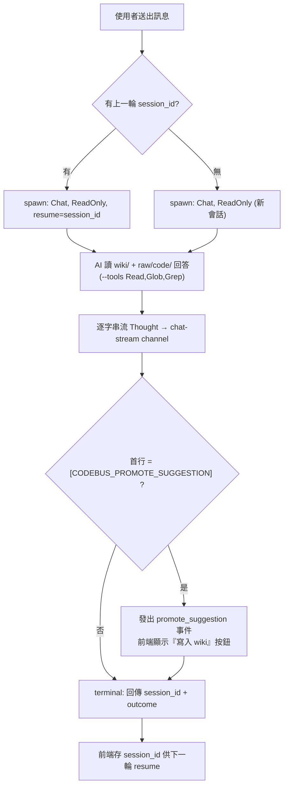
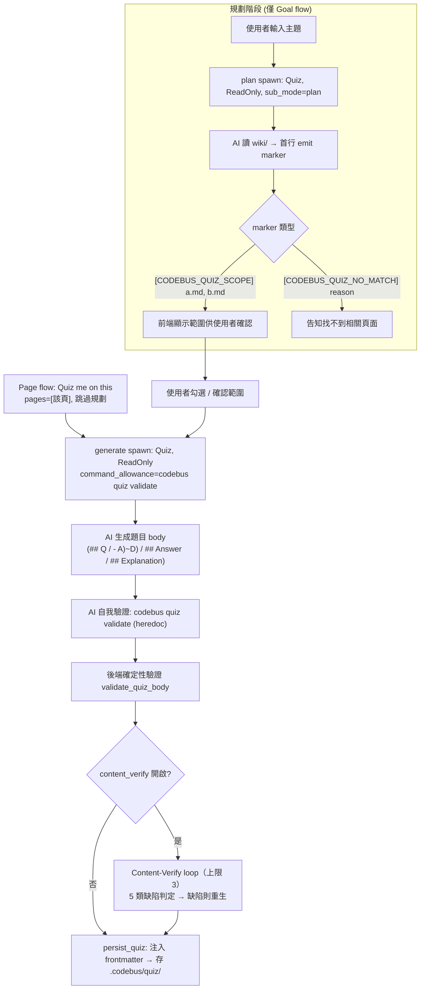
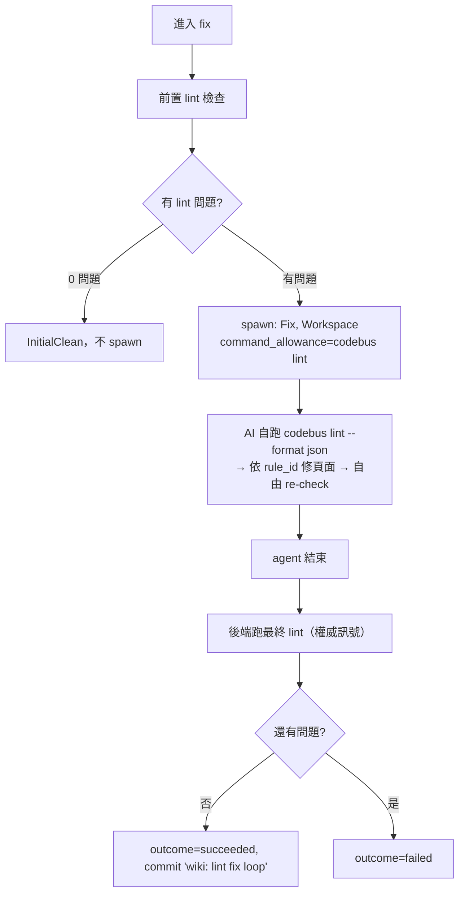
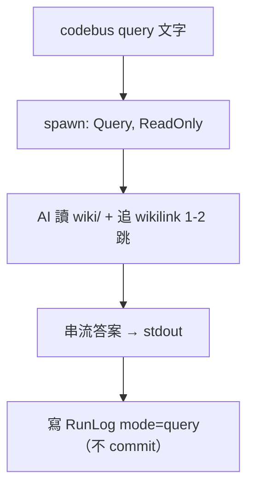
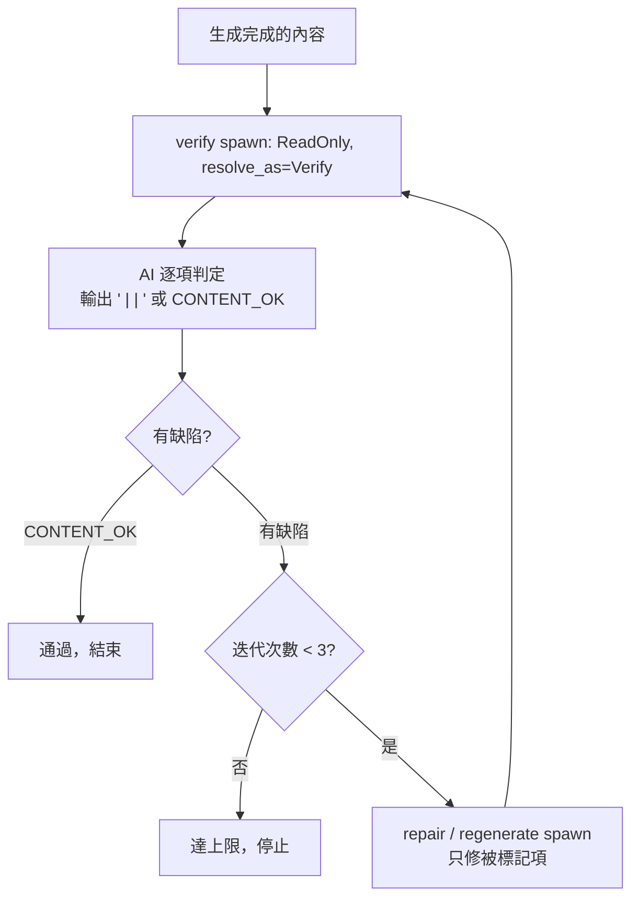
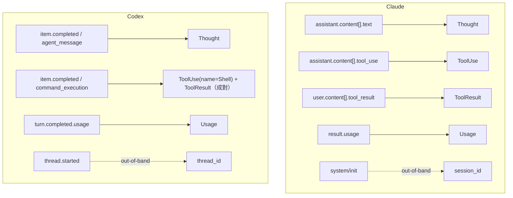
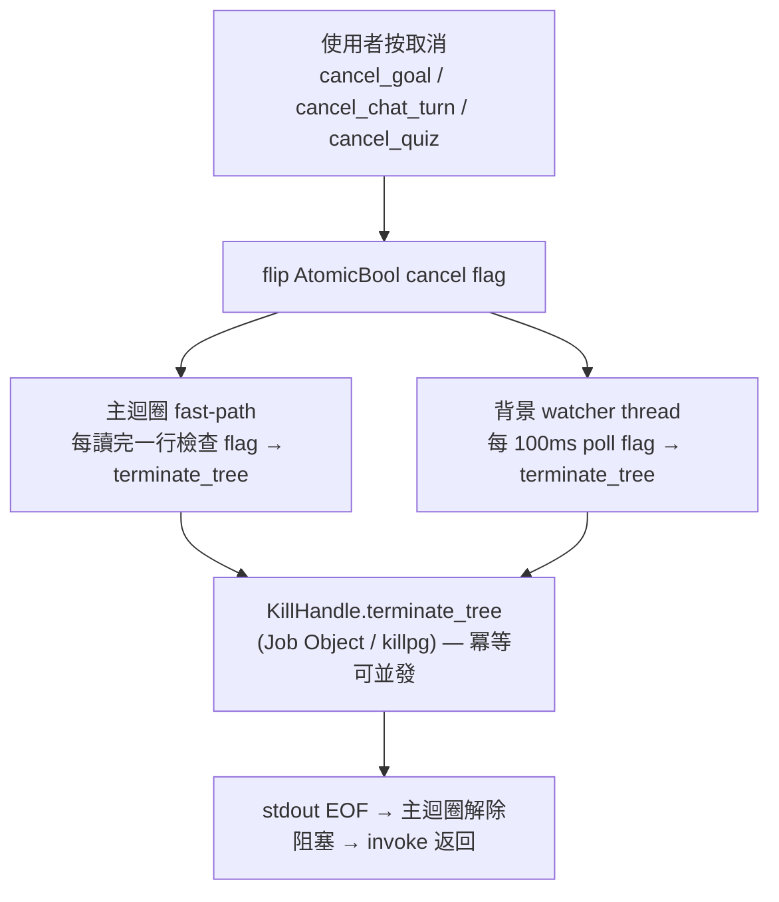

# codebus AI 架構與行為解析

> 本文件說明 codebus 在產品內**如何使用 AI**：哪些功能行為動用了 AI、各自透過什麼機制與旗標（flag）驅動底層 agent CLI、以及這些選擇達成了什麼效果。每個行為都附流程圖。內文所引用的程式位置（`file:line`）均對應現行 Rust / TypeScript 原始碼。

---

## 目錄

1. [核心定位：把 agent CLI 馴服成可控執行引擎](#1-核心定位把-agent-cli-馴服成可控執行引擎)
2. [抽象骨架：Provider × Verb × SpawnSpec](#2-抽象骨架provider--verb--spawnspec)
3. [AI 行為逐一拆解（含流程圖）](#3-ai-行為逐一拆解含流程圖)
   - 3.1 [Goal — 目標導向撰寫 wiki](#31-goal--目標導向撰寫-wiki)
   - 3.2 [Chat — 多輪對話](#32-chat--多輪對話)
   - 3.3 [Quiz — 規劃 → 確認 → 生成 → 驗證](#33-quiz--規劃--確認--生成--驗證)
   - 3.4 [Fix — lint 自我修復迴圈](#34-fix--lint-自我修復迴圈)
   - 3.5 [Query — 唯讀查詢](#35-query--唯讀查詢)
   - 3.6 [Content-Verify — AI 內容驗證迴圈](#36-content-verify--ai-內容驗證迴圈)
4. [旗標與機制對照：Claude vs codex](#4-旗標與機制對照claude-vs-codex)
5. [隔離與安全模型](#5-隔離與安全模型)
6. [串流解析與可觀測性](#6-串流解析與可觀測性)
7. [設定模型](#7-設定模型)
8. [附錄：完整旗標速查表](#8-附錄完整旗標速查表)

---

## 1. 核心定位：把 agent CLI 馴服成可控執行引擎

codebus 是一個本地優先（local-first）的知識管理與學習工具：使用者把一份程式碼 repo 指給它，codebus 會在 repo 旁建立一個獨立的知識庫（vault，位於 `<repo>/.codebus/`），由 AI 讀原始碼、撰寫成可查詢的 wiki 頁面，並能對 wiki 出題、對話問答。

關鍵的工程選擇是：**codebus 不直接呼叫 LLM 的 HTTP API，而是把成熟的 agent CLI 當成一個「可控的執行引擎」來驅動** —— 目前支援兩種 provider：

- **Claude Code**（`claude` CLI）
- **OpenAI Codex**（`codex` CLI）

直接驅動 agent CLI 帶來一個產品 API 沒有的能力：agent 本身能讀檔、寫檔、跑工具、做多步推理。但這也意味著一個未經約束的 agent 可以做任何事。codebus 的全部工程價值，就在於它在 agent CLI 外面包了一整層控制：**每一次 AI 呼叫都被收斂成結構化意圖、按能力最小化授權、在沙箱內執行、輸出被統一解析、行程可被安全終止。**

### 1.1 一次 AI 呼叫的完整資料流



### 1.2 六大設計支柱

| 支柱 | 機制 | 達成的效果 |
|---|---|---|
| **多 provider 可替換** | `AgentBackend` trait + `ProviderConfig` enum，依設定分派 | 切換 `active_provider` 即可整個換引擎，verb 層完全不改 |
| **意圖收斂（verb 抽象）** | 所有 AI 行為收斂成 6 個 verb + `SpawnSpec` | 呼叫面極小、可測試、provider 無關 |
| **能力最小化授權** | 每個行為按 `Permission` + per-verb toolset 拿到剛好夠用的工具 | （Claude provider）prompt injection 即使成功也越不了權；codex provider 的讀取/網路隔離為 soft/partial，見 §5.7 |
| **AI 生成 + 確定性驗證** | AI 產出 → 規則驗證器 + AI 內容驗證迴圈 | 把 LLM 的不確定性收斂到可接受範圍 |
| **串流可觀測** | stdout JSONL → 統一 `StreamEvent` → events log + 即時 UI | 每一步 thought / tool / token 都可見、可重播 |
| **安全行程生命週期** | `KillHandle`（Job Object / process group）+ 雙路徑取消 | 任何時候都能在 ≤ 1s 內安全砍掉整棵行程樹 |

---

## 2. 抽象骨架：Provider × Verb × SpawnSpec

理解 codebus 的 AI 行為，必須先理解三個正交（orthogonal）的維度。

### 2.1 Verb：六種 AI 行為意圖

`Verb` 列舉（`codebus-core/src/config/claude_code.rs:26`）共六個：

| Verb | 是 SKILL bundle? | 用途 |
|---|---|---|
| `Goal` | ✅ | 讀原始碼、撰寫/更新 wiki 頁面 |
| `Query` | ✅ | 唯讀查詢 wiki |
| `Fix` | ✅ | 依 lint 結果自我修復 wiki |
| `Chat` | ✅ | 多輪對話問答 |
| `Quiz` | ✅ | 對 wiki 規劃、出題、驗證 |
| `Verify` | ❌ | **不是** bundle，只是「模型解析鍵」（見 2.4） |

前五個各自對應一個 **SKILL bundle**：codebus 在初始化時把 SKILL.md 寫到 `<vault>/.codebus/.claude/skills/codebus-<verb>/SKILL.md`（codex 則鏡像到 `.codex/skills/codebus-<verb>/`）。SKILL.md 就是送給 AI 的「行為說明書」——包含工具範圍、輸出格式、in-band marker 規則等。

### 2.2 SpawnSpec：provider-neutral 的意圖物件

每一次 AI 呼叫，verb 層都先建立一個 `SpawnSpec`（`codebus-core/src/agent/spawn_spec.rs:95`）。它刻意**不含任何 provider 特定編碼**（沒有 slash command 字串、沒有 CLI flag）：

```rust
pub struct SpawnSpec {
    pub verb: Verb,                              // SKILL bundle 名（Goal/Query/Fix/Chat/Quiz）
    pub resolve_as: Option<Verb>,                // 模型解析覆寫（verify-stage-independent-model）
    pub sub_mode: Option<String>,                // "plan" / "generate" / "verify" / "repair"，或 None（free-text）
    pub input: String,                           // 原始使用者文字，或結構化 body；不含 /codebus- 前綴
    pub permission: Permission,                  // ReadOnly | Workspace（沙箱姿態）
    pub command_allowance: Option<CommandPrefix>,// 精細的單一指令族白名單，如 ["codebus","quiz","validate"]
    pub resume_session_id: Option<String>,       // 多輪對話續接（只有 Chat 會設）
}
```

`permission`、`sub_mode`、`command_allowance` 都是 **per-spawn** 而非由 verb 推導——因為同一個 verb 可以發出多次不同性質的 spawn（例如 Quiz 會發 plan、generate、verify 三種不同的 spec）。

### 2.3 AgentBackend trait：provider 抽象的縫合點

`AgentBackend` trait（`codebus-core/src/agent/backend.rs:25`）是「provider-agnostic 呼叫迴圈」與「具體 agent CLI」之間**唯一**的契約，只有三個必要方法加一個可選方法：

| 方法 | 職責 |
|---|---|
| `build_command(&spec) -> Command` | 把中性的 `SpawnSpec` 翻成該 provider 的完整 argv（binary、flags、權限閘、模型、env） |
| `parse_stream_line(line) -> Vec<StreamEvent>` | 把該 provider 的 wire 格式（JSONL）映射成統一 `StreamEvent`（**僅格式轉換，不解讀 `[CODEBUS_*]` 語意 marker**） |
| `extract_session_id(line) -> Option<String>` | 從 stdout 抓出 session/thread id |
| `stdin_payload(&spec) -> Option<String>`（可選） | 當 CLI 無法用 argv 傳 prompt 時，改走 stdin（codex 在 Windows 的逃生口） |

trait 對呼叫端**完全不暴露** tool / sandbox / MCP / model / argv 等概念——這些全部封裝在實作型別內部。呼叫端唯一拿回來的只有正規化後的跨 provider `StreamEvent`。



### 2.4 模型解析：`resolve_as` 與「驗證階段獨立模型」

`SpawnSpec.config_key()`（`spawn_spec.rs:119`）回傳 `resolve_as.unwrap_or(verb)`。這個小設計支撐了一個重要模式：**generate 用便宜模型、verify 用昂貴模型**。

例如 Quiz 的內容驗證 spawn 設定 `verb: Quiz`（仍呼叫 quiz SKILL bundle）但 `resolve_as: Some(Verify)`，於是它的 SKILL 形式是 `/codebus-quiz verify: ...`，模型卻從專屬的 `verify` 設定區塊解析。這讓「生成」與「把關」可以用不同成本的模型，而不需要另開一個 SKILL bundle。

各 verb 的模型對映規則：

| Verb | Claude 解析鍵 | Codex 解析鍵 |
|---|---|---|
| `Goal` | `system.goal` | `goal` |
| `Query` | `system.query` | `query` |
| `Fix` | `system.fix` | `fix` |
| `Chat` | `system.query`（複用 query） | `query`（複用） |
| `Quiz` | `system.query`（複用 query） | `query`（複用） |
| `Verify` | `system.verify`（獨立區塊，不 fallback） | `verify`（獨立） |

Claude 的 system profile 模型名會自動補前綴（`endpoint.rs:61`）：`opus-4-6` → `claude-opus-4-6`；已含 `claude-` 則原樣通過。Azure profile 則保留 deployment name 不翻譯。

---

## 3. AI 行為逐一拆解（含流程圖）

下表先給全貌，再逐一深入。注意 **Fix 與 Query 沒有獨立的 GUI 觸發鏈**：Fix 是 Goal 內部的子流程（也可由 CLI 觸發），Query 目前是 CLI-only。

| 行為 | GUI 觸發 | Tauri command | core 入口 | Permission | spawn 次數 |
|---|---|---|---|---|---|
| Goal | ✅ New Goal | `spawn_goal` | `run_goal` | Workspace | 1 主 +（fix loop）+（content-verify loop）|
| Chat | ✅ Chat 輸入框 | `spawn_chat_turn` | `run_chat_turn` | ReadOnly | 每輪 1 |
| Quiz plan | ✅ New quiz | `spawn_quiz_plan` | `run_quiz_plan` | ReadOnly | 1 |
| Quiz generate | ✅ 確認範圍 / Quiz me on this | `spawn_quiz_generate` | `run_quiz_generate` | ReadOnly | 1 +（content-verify loop）|
| Fix | ⛔ 無（Goal 子流程 / CLI） | —（goal 內部） | `run_fix_loop` | Workspace | 最多 1 |
| Query | ⛔ 無（CLI-only） | — | `run_query` | ReadOnly | 1 |

---

### 3.1 Goal — 目標導向撰寫 wiki

**用途**：使用者輸入一句自然語言目標（如「整理付款流程」），AI 掃描 `raw/code/`（已做 PII 遮罩的原始碼鏡像），在 `wiki/` 建立或更新知識頁面，最後自動 git commit。

**觸發鏈**（`new-goal-run` 按鈕 → … → `run_goal`）：

```
NewGoalModal "Run" → useGoalsStore.spawnGoal → spawnGoal(ipc.ts)
  → invoke("spawn_goal", {vaultPath, goalText})
  → ipc/goals.rs spawn_goal → run_goal(repo, options, on_event, cancel)
```

**機制與旗標**：主 spawn 建立 `SpawnSpec { verb: Goal, sub_mode: None, permission: Workspace }`（`goal.rs:337`）。`Workspace` 在 Claude 端展開成 `--tools Read,Glob,Grep,Write,Edit`，在 codex 端展開成 `-s workspace-write`——AI 因此能寫 `wiki/`、讀 `raw/code/`，但寫不到沙箱外。

**完整流程**：



**子 spawn 的旗標差異**：

- **content-verify spawn**：`sub_mode: "verify"`、`resolve_as: Some(Verify)`、`permission: ReadOnly`（`goal.rs:464`）。輸入結構化為 `goal=<text>\n\nCHANGED PAGES:\n<path 列表>`。AI 對每個有問題的頁面輸出 `<wiki 路徑> | <defect-type> | <修正建議>`，無問題則輸出 `CONTENT_OK`。Goal 的缺陷分類有 **3 種**（定義在 `GOAL_WORKFLOW` SKILL prompt）：`unfaithful`、`off-goal`、`taxonomy-misplaced`。
- **content-repair spawn**：`sub_mode: "repair"`、`resolve_as: None`（回到 Goal 模型）、`permission: Workspace`（`goal.rs:518`）。只修被標記的頁面。

**效果**：
- **能力分級**：主撰寫階段需要寫權限（Workspace），驗證階段降為唯讀（ReadOnly）——把關者拿不到寫權限，不會邊驗邊改。
- **確定性收斂**：content-verify 是一個有上限（`CONTENT_VERIFY_CAP = 3`，`content_verify.rs:25`）的 verify→repair→re-verify 迴圈，避免無限循環。
- **可回滾**：`.codebus/` 是獨立的 nested git repo，每次 goal 收尾自動 commit `wiki: <goal>`，寫壞了可 `git reset --hard` 還原，且完全不碰使用者的 source repo git。

---

### 3.2 Chat — 多輪對話

**用途**：使用者在 chat 輸入框問問題，AI 讀 `wiki/` 與 `raw/code/`（唯讀）回答，支援多輪續接。當 AI 判斷這段對話值得沉澱成 wiki 頁面時，會在回覆首行加上一個 marker，前端據此顯示「寫入 wiki」按鈕。

**觸發鏈**：`chat-input-send` → `useChatStore.spawnTurn` → `spawn_chat_turn` → `run_chat_turn`。

**機制與旗標**：`SpawnSpec { verb: Chat, permission: ReadOnly, resume_session_id: <上一輪的 id> }`（`chat.rs:191`）。**Chat 是唯一會設定 `resume_session_id` 的 verb**——它把上一輪 terminal 事件回傳的 session id 餵回來，達成多輪記憶：

- **Claude**：argv 加 `--resume <session_id>`（放在 toolset flags 之前）。
- **Codex**：用 `exec resume <id>` 子命令形式；且因為 `codex exec resume` 不接受 `-s`，沙箱改用 `-c sandbox_mode=<mode>` 設定。此外 Chat 是 codex 端**唯一不加 `--ephemeral`** 的 verb——多輪需要 session rollout 檔被保留，否則下一輪 resume 會失敗。



**in-band marker**：`[CODEBUS_PROMOTE_SUGGESTION] `（`chat.rs:65`，含尾端空白）。必須在訊息開頭（byte offset 0），marker 後到第一個換行為 reason（5–15 字），空 reason 會被拒絕。若使用者接受，前端會把整段對話轉成一次 goal spawn（`store/chat.ts` → `spawnGoalIpc`），把對話沉澱成 wiki。

**效果**：
- **唯讀安全**：Chat 永遠是 ReadOnly，即使對話被注入惡意指令也寫不到任何檔。
- **provider 無關的多輪**：「續接會話」這個概念在 `SpawnSpec` 層只是 `resume_session_id`，由各 backend 翻成自己的機制（`--resume` vs `exec resume`），上層無感。

---

### 3.3 Quiz — 規劃 → 確認 → 生成 → 驗證

Quiz 是最能展現「AI 生成 + 確定性驗證」哲學的行為。它有兩條進入路徑：

- **Goal flow**：使用者給主題 → AI **規劃**該考哪些 wiki 頁面 → 使用者**確認範圍** → AI **生成**題目。
- **Page flow**（wiki 頁面上的「Quiz me on this」）：直接以該頁面為對象生成，跳過規劃。



**機制與旗標**：

- **plan spawn**：`SpawnSpec { verb: Quiz, sub_mode: "plan", permission: ReadOnly }`（`quiz.rs:441`）。AI 必須在**第一行**輸出 `[CODEBUS_QUIZ_SCOPE] ` 後接 2–5 個 `wiki/` 路徑，或 `[CODEBUS_QUIZ_NO_MATCH] ` 後接理由。
- **generate spawn**：`SpawnSpec { verb: Quiz, sub_mode: "generate", permission: ReadOnly, command_allowance: ["codebus","quiz","validate"] }`（`quiz.rs:544`）。注意它的 toolset 是 `Read,Glob,Grep,Bash`——**沒有 Write/Edit**：AI 只把題目印到 stdout，由後端落檔，AI 本身不寫檔。`command_allowance` 讓 AI 能在送出前以 `codebus quiz validate - <<'CBQZ'`（heredoc 餵 stdin）自我驗證，但 Bash 被精細限制成只能跑 `codebus quiz validate *`。

**兩道驗證關卡**（這是 Quiz 品質的核心）：

1. **AI 自驗**（SKILL prompt 內，最多 3 次）：生成後 agent 自己跑 `codebus quiz validate` 檢查格式。
2. **後端確定性驗證**（`validate_quiz_body`，`quiz_validate.rs:46`）：完全不靠 LLM 的規則檢查，每題檢查 5 件事：
   - `quiz-schema-stem`：題幹非空
   - `quiz-schema-choices`：恰好有 A/B/C/D 四個選項
   - `quiz-schema-answer`：`## Answer:` 為 A–D 之一
   - `quiz-schema-explanation`：有 `## Explanation:` 段
   - `quiz-broken-wikilink`：解析中引用的 `[[slug]]` 必須真的存在於 vault 目錄

   驗證結果寫進題目 frontmatter（`validation: ok | failed`）。**非致命**：即使 failed 也會落檔（不丟題），但標記出來。

3.（可選）**AI 內容驗證迴圈**（`content_verify`）：見 3.6。Quiz 的缺陷分類有 **5 種**（Mode C SKILL prompt）：`answer-wrong`、`out-of-scope`、`not-exactly-one-correct`、`degenerate-distractor`、`off-topic`。其中 `off-topic` 只在有主題時檢查——Page flow 無主題（`topic: None`），會跳過 off-topic 檢查，其餘 4 項照跑。

**in-band markers**：`[CODEBUS_QUIZ_SCOPE] `、`[CODEBUS_QUIZ_NO_MATCH] `（Rust 常數，`quiz.rs:79-80`）；越界讀取時的 `[CODEBUS_QUIZ_VIOLATION] ` 則只定義在 SKILL prompt（`skill_bundle/mod.rs:673`）、由 agent 自行 emit，後端不以常數解析。

**效果**：
- **人機協作的範圍把關**：規劃與生成之間有一道使用者確認 gate，避免 AI 自作主張考錯範圍。
- **三層品質防線**：AI 自驗（格式）→ 確定性規則驗證（schema + 死連結）→ AI 內容驗證（語意正確性），把 LLM 出題的不確定性層層收斂。
- **AI 不落檔**：generate 階段 AI 無寫權限，題目由後端落檔並注入權威 frontmatter（`quiz_id` 等欄位 AI 禁止自寫）。

---

### 3.4 Fix — lint 自我修復迴圈

**用途**：對 `wiki/` 跑 lint，若有問題就 spawn 一個 AI agent 自行讀寫頁面修復；agent 可在 session 內多次自跑 `codebus lint` 看修得如何；CLI 只在 agent 結束後跑**一次**最終 lint 作為權威成功訊號。

**沒有獨立 GUI 觸發**：Fix 是 `run_goal` 內部、由 `lint.fix.enabled` 控制的子流程（`goal.rs:380` 的 `if fix_cfg.enabled` 閘），也可由 CLI `codebus fix` 觸發。兩者都呼叫同一個 `run_fix_loop`。

**機制與旗標**：`SpawnSpec { verb: Fix, permission: Workspace, command_allowance: ["codebus","lint"] }`（`wiki/fix/mod.rs:141`）。toolset 為 `Read,Glob,Grep,Write,Edit,Bash` + 精細白名單 `Bash(codebus lint *)`——AI 能讀寫 wiki，且只能跑 `codebus lint`，不能跑任意 shell。`input` 為空字串（AI 自己去抓 lint 結果）。



**效果**：
- **單次 spawn、迴圈在 agent 內**：CLI 不做多輪 spawn，而是讓 agent 在一次 session 內自我迭代，最後由確定性的 lint 當裁判——把「修到好為止」的判斷交給規則，不交給 LLM 自評。
- **Bash 精細閘**：`Bash(codebus lint *)` 確保即使 prompt injection 也只能跑這一個指令族。

---

### 3.5 Query — 唯讀查詢

**用途**：輸入問題，AI 讀 `wiki/` 回答（唯讀、不寫、不 commit）。目前為 CLI-only（`codebus query "..."`），GUI 端由 Chat 涵蓋。

**機制與旗標**：`SpawnSpec { verb: Query, permission: ReadOnly }`（`query.rs:155`），toolset `Read,Glob,Grep`。SKILL workflow 為 4 步：解析問題 → 找候選頁面（先讀 frontmatter）→ 沿 wikilink 追 1–2 跳 → 印出答案。



**效果**：最小授權的純讀路徑，作為輕量、低成本（預設 `haiku-4-5` / low effort）的知識查詢。

---

### 3.6 Content-Verify — AI 內容驗證迴圈

這是 Goal 與 Quiz **共用**的一個機制（`content_verify.rs`），用 AI 當「第二讀者」檢查 AI 自己生成的內容是否忠實、是否離題。



**機制要點**：
- 驗證 spawn 一律 `permission: ReadOnly` + `resolve_as: Some(Verify)`——把關者唯讀，且可用獨立（通常更強）的 verify 模型。
- 缺陷以 `<id> | <defect-type> | <suggestion>` 三段格式回傳，後端以 `splitn(3, '|')` 解析、各段 trim（`content_verify.rs:53`）。**缺陷分類的語意定義在 SKILL prompt 內，Rust 端只做 opaque 字串解析**——這讓分類體系能在 prompt 層演進而不需改程式。
- 迴圈上限 `CONTENT_VERIFY_CAP = 3`，Goal 與 Quiz 共用。

**效果**：把「LLM 生成內容可能不忠實/離題」這個風險，用一個有界的 AI 自我審查迴圈收斂，並以 ReadOnly + 獨立模型確保把關階段的中立與品質。

---

## 4. 旗標與機制對照：Claude vs codex

這是本報告的技術核心：同一個 `SpawnSpec`，兩個 backend 如何翻成各自的 argv。

### 4.1 Claude 完整 argv（順序穩定，有 byte-level 測試保護）

`compose_claude_cmd`（`claude_cli.rs:352`）組出的 argv 順序：

```text
claude
  -p <slash_command>                      # 1. prompt（見下方格式）
  --resume <session_id>                   # 2. 僅 Chat 多輪時出現
  --tools <csv>                           # 3. 工具硬閘（白名單）
  --allowedTools <csv>                    # 4. 自動核准範圍（含精細 Bash specifier）
  --permission-mode acceptEdits           # 5. -p 模式必要
  --output-format stream-json             # 6. 開啟 JSONL 串流
  --verbose                               # 7. stream-json 必要
  --strict-mcp-config                     # 8. 只用 --mcp-config 指定的 server
  --mcp-config {"mcpServers":{}}          # 9. 空設定 = 零 MCP
  --model <m>                             # 10. 選填
  --effort <e>                            # 11. 選填
```

- **prompt 格式**：free-text → `/codebus-<bundle> "<input>"`（加引號）；sub-mode → `/codebus-<bundle> <mode>: <input>`（不加引號）。永遠透過 `-p` argv 傳遞，**stdin 關閉**。
- **每個 flag 的目的→效果**：

| Flag | 目的 | 效果 |
|---|---|---|
| `--tools <csv>` | 工具白名單硬閘 | **未列出的工具完全用不了**——這是真正的 sandbox |
| `--allowedTools <csv>` | 自動核准（免互動確認） | `-p` 無 terminal，否則每次用工具都卡住等確認 |
| `--permission-mode acceptEdits` | `-p` 模式必要 | 否則預設仍會 prompt 而卡死 |
| `--output-format stream-json` + `--verbose` | 結構化串流 | 可即時解析 thought/tool/usage |
| `--strict-mcp-config` + `--mcp-config {"mcpServers":{}}` | MCP 載入層隔離 | **零 ambient MCP**（user/project/connector 一律不載入），無逃生口 |
| `--model` / `--effort` | per-verb 模型與努力等級 | 成本控制（query 用便宜模型、goal/verify 用強模型） |

### 4.2 Codex 完整 argv

`CodexBackend::build_command`（`codex_backend.rs:90`）：

```text
codex.cmd (Windows) / codex (Unix)
  exec
  resume <session_id>                     # 僅 Chat 多輪時
  --json                                  # JSONL 輸出
  --ignore-user-config                    # 丟棄使用者全域 config / MCP
  --disable apps                          # 停用 codex_apps plugin
  --ignore-rules                          # 停用 execpolicy
  --skip-git-repo-check
  -c project_root_markers=['.codebus-vault']  # 釘住 project root 到 vault
  -c windows.sandbox=unelevated           # 重新啟用 Windows 沙箱能力
  -c web_search=disabled                  # 關閉內建網路搜尋
  --ephemeral                             # 非 Chat verb 才加（不留 session 檔）
  -s <read-only|workspace-write>          # 新會話沙箱；resume 改用 -c sandbox_mode=<mode>
  -m <model>
  -c model_reasoning_effort=<effort>
  [Azure: -c model_provider=azure ... env_http_headers.api-key=CODEBUS_CODEX_AZURE_KEY]
  <prompt 或 ->                           # 單行走 argv；多行走 stdin（傳 -）
```

- **prompt 格式**：`$codebus-<bundle> <input>`（free-text 不加引號）或 `$codebus-<bundle> <mode>: <input>`。`$` 前綴走 codex 原生的 skill 顯式呼叫機制，相較 `/` 前綴的 description-match 路徑可省約 **24.8%** 的 input token（此數值量測於 codex-cli 0.133.0，版本升級後需重驗）。
- **多行 prompt 走 stdin**：verify/repair 等含 `\n` 的結構化輸入，因 Windows `.cmd` shim + Rust 1.77+ 拒絕含換行的 argv element，改在 argv 放 `-`、prompt 由 `stdin_payload()` 經 stdin 餵入。
- **每個 flag 的目的→效果**：

| Flag | 目的 | 效果 |
|---|---|---|
| `--ignore-user-config` | 隔離使用者全域設定 | 不載入 `~/.codex/config.toml` 與其 MCP |
| `--disable apps` | 停用 plugin | 關閉 codex_apps 工具面 |
| `--ignore-rules` | 停用 execpolicy | 由 codebus 自己用 `-s` 控制 |
| `-c project_root_markers=['.codebus-vault']` | 釘住 project root | 排除被分析 repo 的 `.codex/` 與 `AGENTS.md`，避免它們污染 agent 行為 |
| `-c windows.sandbox=unelevated` | 重啟 Windows 沙箱 | `--ignore-user-config` 會清掉沙箱能力，不補回則連 Shell 子行程都跑不起來 |
| `-c web_search=disabled` | 關內建 hosted 網搜工具 | 使 agent 無法用內建網搜抓 URL；但非封死所有外連——model 經 shell 的 raw egress 由 `-s` 沙箱治理，見 §5.7 |
| `--ephemeral` | 不留 session 檔 | 單次 verb 不殘留；Chat 例外（多輪需 rollout） |
| `-s <mode>` | OS-native 沙箱 | `read-only` / `workspace-write` 對應 `Permission` |

### 4.3 並排對照：同一意圖的兩種展開

| `SpawnSpec` 概念 | Claude 展開 | Codex 展開 |
|---|---|---|
| prompt 載體 | `-p` argv（stdin 關閉） | 位置參數（單行）/ stdin（多行 `-`）|
| SKILL 呼叫前綴 | `/codebus-<verb>` | `$codebus-<verb>`（省 token） |
| `Permission::ReadOnly` | `--tools Read,Glob,Grep` | `-s read-only` |
| `Permission::Workspace` | `--tools ...,Write,Edit` | `-s workspace-write` |
| `command_allowance` | `Bash(<prefix> *)` 精細閘 | 無等價機制（僅警告，由 `-s` 概括治理） |
| 多輪 resume | `--resume <id>` | `exec resume <id>` + `-c sandbox_mode=` |
| MCP 隔離 | `--strict-mcp-config` + 空 config | `--ignore-user-config` + `--disable apps` |
| 模型 / 努力 | `--model` / `--effort` | `-m` / `-c model_reasoning_effort=` |
| API key 注入 | env `ANTHROPIC_API_KEY`（Azure） | env `CODEBUS_CODEX_AZURE_KEY`（**不入 argv**）|

---

## 5. 隔離與安全模型

codebus 的威脅模型很明確：**使用者輸入會直接成為送給 LLM 的 prompt 的一部分**，因此可能藏有 prompt injection。codebus 用多層機制限制「即使 injection 成功，agent 能造成的傷害」。

### 5.1 工作目錄隔離

每個 spawn 的子行程 `current_dir` 都設成 `<repo>/.codebus/`（`claude_cli.rs:114`），不是 source repo root。agent 的相對路徑視野被釘在 vault 內。

### 5.2 能力分級的 toolset（per-verb）

| Verb | Claude toolset | 能做什麼 |
|---|---|---|
| `goal` | `Read,Glob,Grep,Write,Edit` | 讀 source、寫 wiki |
| `query` / `chat` / `quiz`(plan/verify) | `Read,Glob,Grep` | 純讀，**不能寫** |
| `quiz`(generate) | `Read,Glob,Grep,Bash` + `Bash(codebus quiz validate *)` | 純讀 + 只能跑 quiz 自驗，**無 Write/Edit** |
| `fix` | `Read,Glob,Grep,Write,Edit,Bash` + `Bash(codebus lint *)` | 讀寫 wiki + 只能跑 `codebus lint` |

工具採**白名單機制**（只有清單內列出的 built-in 工具可用），因此 `WebFetch` / `WebSearch` / `AskUserQuestion` / `Task`（spawn 子 agent）/ `NotebookEdit` / 所有 MCP 工具、以及未來新增的工具一律被擋。效果是：即使 prompt injection 成功，agent 也**無法用內建工具連網外傳、無法 spawn 子 agent、無法跑白名單外的任意 shell**。

### 5.3 Triple-flag 閘（Claude）

`--tools`（硬閘）+ `--allowedTools`（自動核准）+ `--permission-mode acceptEdits`（`-p` 必要）三者缺一不可：關鍵案例是即使 `--allowedTools` 含 Write + acceptEdits，只要 `--tools` 不含 Write，**Write 仍被硬閘擋下**。所以 `--tools` 才是真正的 sandbox。

### 5.4 PII filter：原始碼進入 AI 視野前的最後一道

當 `init` / `goal` 把 source 複製進 `<repo>/.codebus/raw/code/` 給 AI 讀之前，會先跑 PII 掃描（`RegexBasicScanner`）：

| Pattern | 嚴重度 | 預設動作 |
|---|---|---|
| AWS access key | Critical | **強制遮罩**（使用者設定無法降級） |
| Anthropic API key | Critical | **強制遮罩** |
| Email | Warn | 可調 warn / skip / mask |
| IPv4 | Warn | 可調 |

效果：即使密鑰被寫死在 source，也不會被 sync 進 raw mirror 給 LLM 看到。Critical 是不可降級的安全下限。

### 5.5 API key 注入：env，不入 argv

- **Claude（Azure）**：以 `cmd.envs(...)` 只在子行程注入 `ANTHROPIC_BASE_URL` / `ANTHROPIC_API_KEY` / `CLAUDE_CODE_DISABLE_ADVISOR_TOOL=1`（`env_overrides.rs:50`），**不修改父 shell 環境**。
- **Codex（Azure）**：key 以 `cmd.env(CODEBUS_CODEX_AZURE_KEY, key)` 注入子行程，codex 透過 `-c ...env_http_headers.api-key=CODEBUS_CODEX_AZURE_KEY` 讀它——**key 絕對不出現在 argv**。
- key 來源 fallback：OS keyring → 環境變數 → 明確錯誤。

### 5.6 nested git 回滾

`.codebus/` 自己是獨立 git repo。`goal` / `fix` 收尾自動 commit。寫壞了隨時 `git reset --hard`，source repo 一行都沒動。

### 5.7 誠實的隔離邊界

工程誠信要求標明邊界，而非宣稱滴水不漏：

- **§5.1–§5.6 的 cwd 隔離 + toolset 硬閘是 Claude provider 的機制。** Codex provider 走 OS-native 沙箱（`-s`）+ config 隔離旗標。
- **Codex 在 Windows unelevated 的實測邊界**（已驗證，codex-cli 0.135.0）：
  - **讀取（soft/partial）**：`workspace-write` 與 `read-only` **兩種模式都**讀得到 workspace 外的檔；`workspace-write` 連 `%USERPROFILE%` 內的檔（`~/.ssh`、`~/.aws` 等家目錄機密屬此類）也讀得到。改用 read-only 並不能避免家目錄讀取外洩。
  - **寫入（較硬但非全擋）**：`workspace-write` 對正常 ACL 路徑（含家目錄）寫入被擋（回 `Access is denied`），但 **Everyone-writable（`*S-1-1-0`）目錄**（如 `C:\Windows\Temp`、ACL 寬鬆的 app 目錄）仍寫得進去；`read-only` 模式所有寫入被擋。
  - **網路 egress（只擋一半）**：外部 HTTPS/443 被擋，但 loopback（127.0.0.1）與外部 HTTP/80 放行。

  因此 codex 路徑對「家目錄機密讀取」的硬隔離，需要 elevated backend（需 admin）或 AppContainer/WSL2 外包；現階段以 `AGENTS.md` 的 normative soft constraint（禁讀 `~/.ssh`、`~/.aws` 等）+ 模型自律補足。涉及敏感家目錄讀取的任務建議走 Claude provider。
- **macOS / Linux 尚未實測**，不從 Windows 結果外推。

這些邊界都被 codebus 的設定旗標（`--ignore-user-config` / `--disable apps` / `web_search=disabled`）在「config / plugin / 網搜功能」層確實擋住；與「模型自己用 shell 打 raw egress」是兩回事，後者才是 `-s` 沙箱只擋一部分的部分。

### 5.8 仍需使用者自己當心

Prompt injection 這條 codebus 不替你過濾：把不可信內容（GitHub issue、網頁、他人訊息）整段貼進 goal/query/chat 是危險的。建議自己讀過、抽出真正的問題、用自己的話輸入。

---

## 6. 串流解析與可觀測性

### 6.1 統一事件模型 StreamEvent

兩種 provider 的 stdout 格式不同，但都被映射成同一個 `StreamEvent`（`parser.rs:60`，`#[serde(tag = "kind")]`）：

| Variant | 意義 |
|---|---|
| `Thought { text }` | AI 的 assistant 輸出文字 |
| `ToolUse { name, input, tool_kind }` | 工具呼叫（Read/Write/Edit/Bash/Shell…）|
| `ToolResult { output, is_error }` | 工具結果 |
| `Usage(TokenUsage)` | token 用量 |

`tool_kind`（`read`/`inspect`/`mutation`/`other_read`/`other_write`）由 agent 端標註、**不是 parser 推斷**（Claude 經 SKILL 標註；codex 則來自 CLI 的 `command_execution` item 欄位，現況多半為 `None`）——用於前端「READING CODEBASE / WRITING WIKI」兩階段叢集渲染。（欄位刻意叫 `tool_kind` 而非 `kind`，因為外層 enum 已用 `kind` 當 serde tag。）



### 6.2 兩個 parser 的關鍵差異

| 面向 | Claude | Codex |
|---|---|---|
| session id 來源 | `system`/`init` 的 `session_id` | `thread.started` 的 `thread_id` |
| 工具事件 | tool_use 與 tool_result 各自獨立一行 | 一個 `command_execution` 同時產出 ToolUse + ToolResult **兩個事件** |
| usage 時機 | session 結束的 `result` 事件 | 每輪 `turn.completed`（**cumulative，非 per-turn delta**）|
| cache read 欄位 | `cache_read_input_tokens` | `cached_input_tokens` |
| cache write | `cache_creation_input_tokens` | 無 |
| reasoning tokens | 無 | `reasoning_output_tokens` |

兩者都對畸形 JSON 與未知事件型別回傳空 vec（forward-compat，不報錯）。

### 6.3 token 用量追蹤

`TokenUsage`（`log/sink.rs:25`）是 provider 無關的結構，`accumulate_token_usage` 以 `saturating_add` 累加 input/output，Optional 欄位（cache/reasoning）以「兩者皆有才加總、單邊有則保留」合併。需要注意：codex 的 `turn.completed` usage 是 cumulative（一次到位的累計值），因此 UI 若要做即時成本累進，codex 路徑應取「最後一筆 cumulative」而非逐筆相加。

### 6.4 RunLog 與 outcome

每次 run 結束寫一筆 `RunLog` 到 `<vault>/.codebus/log/runs-YYYY-MM-DD.jsonl`（依 `started_at` 日期分檔）；每個 `VerbEvent` 即時逐筆寫到 `events-<slug>.jsonl`（slug = `started_at` 的 `:` 換成 `-`，相容 NTFS 檔名）。

- `mode`：`goal` / `chat` / `quiz` / `fix` / `query`
- `outcome`（封閉三值）：`succeeded` / `failed` / `cancelled`
  - 例：Goal 在 agent 非零退出或修復後 lint 仍有問題時為 `failed`，否則 `succeeded`
- `interrupt_reason`（與 outcome 正交）：`app-close` / `user-cancel` / `network-drop` / `other`

### 6.5 取消：跨行程樹的安全終止

agent CLI 在 Windows 是 `cmd.exe → node.exe` 的 `.cmd` shim，孫程序會繼承 stdout pipe；若只 kill 直接子行程，孫程序仍持有 pipe，主迴圈讀取永遠不返回。codebus 用 `KillHandle`（`process_kill.rs`）解決：

- **Windows**：建立 Job Object，設 `JOB_OBJECT_LIMIT_KILL_ON_JOB_CLOSE`，spawn 後把子行程 assign 進 job，`TerminateJobObject` 殺掉整棵 descendant tree。
- **Unix**：spawn 前 `process_group(0)` 讓子行程成為 PGID leader，`killpg(pgid, SIGTERM)` 殺整組。

並用**雙路徑取消**確保 ≤ 1s 反應：



為什麼要兩條：當 agent 卡在網路呼叫而不輸出 stdout 時，主迴圈的 `BufReader::lines()` 會阻塞，inline 檢查跑不到；watcher thread 在自己的節奏上 poll，砍掉行程樹後 stdout EOF 才能解除主迴圈阻塞。兩條都冪等，可安全並發；watcher 在 `invoke` 返回前被嚴格 join，不會對回收的 PID 誤殺。

---

## 7. 設定模型

使用者透過 `~/.codebus/config.yaml` 設定要用哪個 provider 與各 verb 的模型。結構（`endpoint.rs` / `codex.rs`）：

```yaml
agent:
  active_provider: claude          # 或 codex；缺省 = claude
  providers:
    claude:
      active: system               # 或 azure
      system:
        goal:   { model: opus-4-6,   effort: high }
        query:  { model: haiku-4-5,  effort: low }
        fix:    { model: sonnet-4-6, effort: medium }
        verify: { model: opus-4-6,   effort: high }
      azure:
        base_url: https://<resource>.cognitiveservices.azure.com/anthropic
        keyring_service: codebus-azure
        goal:   { model: <deployment>, effort: high }
        # ... query / fix / verify
    codex:
      active: system
      system:
        goal:   { model: gpt-5.5, effort: high }
        # ... query / fix / verify
      azure:
        base_url: https://...
        api_version: 2025-04-01-preview   # codex Azure 特有
        keyring_service: codebus-codex-azure
        # ... 四個 verb
```

要點：
- `active_provider` 只接受 `claude` / `codex`，其他值會被拒。
- 切換 `active_provider` 即可整個換引擎——`build_backend`（`dispatch.rs:87`）依此回傳 `ClaudeBackend` 或 `CodexBackend`，verb 層完全不感知。
- `Chat` 與 `Quiz` 在設定上**複用 `query`** 的模型/努力；`Verify` 有獨立區塊不 fallback（支撐「生成便宜、驗證昂貴」）。
- active profile 的四個 verb 必填；非 active profile 可缺（作為冷儲存）。

---

## 8. 附錄：完整旗標速查表

### 8.1 Claude（`claude -p`）

| Flag | 值 | 來源 |
|---|---|---|
| `-p` | `/codebus-<verb> ["]<input>["]` | 永遠 |
| `--resume` | `<session_id>` | 僅 Chat 多輪 |
| `--tools` | `Read,Glob,Grep[,Write,Edit][,Bash]` | 依 Permission + allowance |
| `--allowedTools` | 同上 + `Bash(<prefix> *)` | 依 allowance |
| `--permission-mode` | `acceptEdits` | 永遠 |
| `--output-format` | `stream-json` | 永遠 |
| `--verbose` | — | 永遠 |
| `--strict-mcp-config` | — | 永遠 |
| `--mcp-config` | `{"mcpServers":{}}` | 永遠 |
| `--model` | per-verb | 選填 |
| `--effort` | per-verb | 選填 |
| env `ANTHROPIC_BASE_URL` / `ANTHROPIC_API_KEY` / `CLAUDE_CODE_DISABLE_ADVISOR_TOOL=1` | — | 僅 Azure profile |

### 8.2 Codex（`codex exec`）

| Flag | 值 | 來源 |
|---|---|---|
| `exec` [`resume <id>`] | — | resume 僅 Chat 多輪 |
| `--json` | — | 永遠 |
| `--ignore-user-config` | — | 永遠 |
| `--disable apps` | — | 永遠 |
| `--ignore-rules` | — | 永遠 |
| `--skip-git-repo-check` | — | 永遠 |
| `-c project_root_markers` | `['.codebus-vault']` | 永遠 |
| `-c windows.sandbox` | `unelevated` | 永遠 |
| `-c web_search` | `disabled` | 永遠 |
| `--ephemeral` | — | 非 Chat verb |
| `-s` / `-c sandbox_mode=` | `read-only` / `workspace-write` | 依 Permission（resume 走 `-c`）|
| `-m` | per-verb model | 選填 |
| `-c model_reasoning_effort=` | per-verb effort | 選填 |
| `-c model_provider=azure` 等系列 | — | 僅 Azure profile |
| env `CODEBUS_CODEX_AZURE_KEY` | API key | 僅 Azure profile（不入 argv）|
| 位置參數 / `-` | `$codebus-<verb> <input>` | 單行 argv / 多行走 stdin |

### 8.3 in-band markers（verbatim）

| Marker | 出處 | 用途 |
|---|---|---|
| `[CODEBUS_QUIZ_SCOPE] ` | Quiz plan | 規劃出的頁面範圍（逗號分隔）|
| `[CODEBUS_QUIZ_NO_MATCH] ` | Quiz plan | 找不到相關頁面 + 理由 |
| `[CODEBUS_QUIZ_VIOLATION] ` | Quiz | agent 嘗試越界讀取 |
| `[CODEBUS_PROMOTE_SUGGESTION] ` | Chat | 建議把對話沉澱成 wiki |
| `CONTENT_OK` | Content-Verify | 無內容缺陷 |
| `<id> \| <defect-type> \| <suggestion>` | Content-Verify | 單筆缺陷（後端 `splitn(3, '\|')` 解析）|

### 8.4 關鍵常數

| 常數 | 值 | 出處 |
|---|---|---|
| `CONTENT_VERIFY_CAP` | `3` | content-verify 迴圈上限（Goal/Quiz 共用）|
| 量化驗證規則 | `quiz-schema-stem` / `-choices` / `-answer` / `-explanation` / `quiz-broken-wikilink` | `validate_quiz_body` |
| Goal 缺陷分類 | `unfaithful` / `off-goal` / `taxonomy-misplaced` | `GOAL_WORKFLOW` SKILL |
| Quiz 缺陷分類 | `answer-wrong` / `out-of-scope` / `not-exactly-one-correct` / `degenerate-distractor` / `off-topic` | Quiz Mode C SKILL |

---

*本文件描述的是現行原始碼的實際行為；隔離邊界一節刻意標明各平台/各 provider 的實測範圍，以反映工程上對「擋得住什麼、擋不住什麼」的誠實判斷。*
