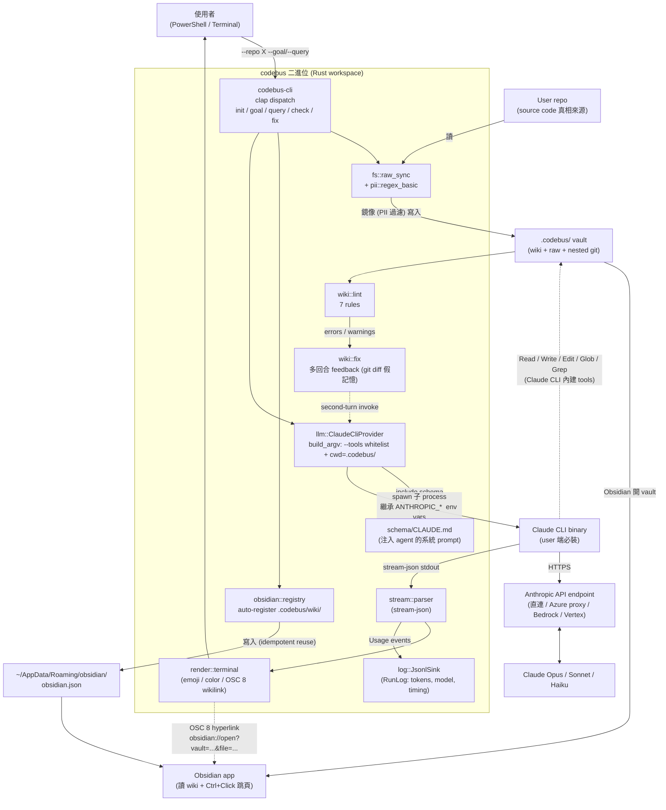

# Codebus 形式抉擇：Rust Binary vs Claude Code Skill

**日期**：2026-05-08
**狀態**：未拍板，等 trigger event
**參與者**：harry + Claude（discussion mode）

---

## 1. Context

Codebus 目前是一個 Cargo workspace（`codebus-core` + `codebus-cli` + `codebus-app`），核心執行模型是 spawn `claude -p` 子 process、解析 stream-json、依 Karpathy 5-folder schema 漸進式建立 `.codebus/wiki/`。phase 1 已交付：CLI parity、5-folder taxonomy + wikilink、`--tools` whitelist sandbox、auto-lint、source enrichment + stale detection、PII filter、lint feedback loop、token tracking、Obsidian-clickable wikilinks。

討論觸發點：原本 README roadmap #1 計畫做「**自製 LlmProvider 抽象 + tool runtime**」以支援多 LLM 提供者，預估工時 4-6 週。討論過程中浮出兩條替代路徑：

1. **「專注 Claude CLI + 透過 base URL 接外部 proxy」** — 不抽象，靠 Claude Code 自己的 `ANTHROPIC_BASE_URL` 機制接 LiteLLM / Ollama / Azure AI Foundry。實機驗證 → 可行（細節見 §8）。
2. **「直接做成 Claude Code skill + skill script」** — 不發 Rust binary，把 codebus 的 schema 規則寫成 skill markdown，lint / PII / enrich 拆成 Python script。User 提出，本文核心。

---

## 2. 現階段架構（Rust binary 路徑）

下圖描繪 codebus 目前的執行模型，作為 §4「四路全景」之前的視覺 anchor。



幾個關鍵分層觀察：

- **Schema (`schema/CLAUDE.md`) 是這個系統的「智慧」**——5-folder taxonomy、頁面寫作規範、out-of-scope 偵測、refusal 行為都寫在這份 markdown，被 Rust 程式碼以 `include_str!` 內嵌、注入 agent prompt
- **Rust 端做的事大多是 plumbing**：spawn、parse、render、lint check、寫檔、git auto-commit、跨 OS 路徑
- **`claude -p` 子 process 是執行核心**：它帶著內建的 Read/Write/Edit/Glob/Grep tools 對 vault 寫入；Rust 端不直接寫 wiki 內容
- **Multi-LLM 接入點在最右側 `API`**：透過 Claude CLI 的 `ANTHROPIC_BASE_URL` / `CLAUDE_CODE_USE_BEDROCK` / `CLAUDE_CODE_USE_VERTEX` 等 env var 切換，不需要 codebus 自己抽象（細節見 §8）

這個圖也凸顯一件事：**如果把 Rust workspace 拿掉，剩下的（schema markdown + lint 規則 + raw_sync + obsidian 註冊）改寫成 Python script + skill markdown，整體流程仍然成立**——這正是 §4「四路全景」要量化的命題之一。

---

## 3. 核心觀察

> 「實務上假如要用 claude code 的話我直接用 skill 跟 skill script 加以檢查感覺就做完了」 — harry, 2026-05-08
>
> 「我覺得應該是差不多 都是 prompt」

這兩句話戳到 codebus 的本質：**99% 的「智慧」來自 prompt**（即 `codebus-core/src/schema/CLAUDE.md`），Rust binary 大部分是 plumbing（spawn、stream parse、render、CLI flag）。如果改成 skill 形式，prompt 是同一份、產出 wiki 應該差不多。

那 Rust binary 提供的獨特價值剩什麼？盤點如下。

---

## 4. 四路全景

整理討論過程中浮現的全部備選方向，至少四條：

| 路線 | 一句話 | 工作量 | Audience | 解綁 Claude CLI | Custom tool 路 |
|---|---|---|---|---|---|
| **A. 自製 LlmProvider + tool runtime** | codebus 自己包 API call + Read/Write/Glob/Grep/Edit 工具實作 | **大**（4-6 週） | 含「沒裝 CLI、只有 API key」的人 | ✅ | ✅ typed |
| **B. 多 CLI provider**（保留 trait，但只 spawn 各家 vendor CLI） | LlmProvider trait 多個 impl：`ClaudeCodeCli` / `CodexCli` / `GeminiCli` / `MyCoderCli`...（細節見 §7） | **中**（每家 1-2 天 adapter） | 各家 coding-CLI 用戶 | ✅（解綁到一群 CLI） | ❌（tool 由各 CLI 主導） |
| **C. Claude CLI + base URL proxy** | 不抽象、不擴增；只透過 `ANTHROPIC_BASE_URL` 接 LiteLLM/Ollama/Azure（細節見 §8） | **小**（cookbook 文件） | Claude CLI + 自跑 proxy 的人 | ❌（仍綁 Claude CLI binary） | ❌ |
| **D. Skill + script pivot** | 把 codebus Rust workspace 改寫成 Claude Code skill + Python lint/PII script | **重做**（2-3 天 pivot） | Claude Code 用戶 | N/A | ❌ |

下表是 **A 跟 D 的細節對比**（最常拿來想的兩端，框出「現狀 vs 完全 pivot」的 spectrum）。B 跟 C 的細節分別在 §7、§8。

### 4.1 A 跟 D 的 dimension 對比

| 面向 | 現在（Rust binary spawn `claude -p`） | Claude Code skill + script |
|---|---|---|
| 入口 | `codebus --repo X --goal "..."` | 在 Claude Code 內 `/codebus build-wiki "..."` |
| 流程編排者 | Rust main loop | Claude Code agent 跟 skill markdown |
| Schema / 5-folder 規則 | `schema/CLAUDE.md` 注入 prompt | 同樣 markdown，放 `~/.claude/skills/codebus/CLAUDE.md` |
| 內建 tools (Read/Glob/Grep/...) | Claude CLI 提供 | 同樣 Claude Code 提供 |
| Sandbox | Rust `--tools` whitelist + cwd isolation | Claude Code permissions 模型（user 本來就用） |
| Lint 規則 | Rust `wiki/lint/rules/*.rs`（7 條） | Python `lint.py`，~200 行 |
| PII filter | Rust `pii/regex_basic` | Python `pii_scan.py`，同套 patterns |
| Stale detect / source enrichment | Rust `wiki/stale_detect.rs` | Python `enrich.py`，比 sha256 |
| Token tracking | Rust `RunLog` jsonl | Claude Code 內建 `/cost` |
| Stream-json render | Rust `render/renderers/terminal.rs` | Claude Code 自己的 UX |
| Multi-LLM 切換 | 需自製 LlmProvider trait + tool runtime（4-6 週）| **完全 inherit Claude Code 的 base URL 設定，不需做任何事** |
| Onboarding | 裝 codebus + 裝 Claude CLI + 設 env vars | 裝 Claude Code → copy skill 檔 → 0 額外裝載 |
| 散播 | `cargo install codebus` / Homebrew tap / GitHub release | Skill copy / pull |
| 跨平台 binary | 要做 cross-platform CI matrix | N/A |

---

## 5. Skill 路徑的好處

1. **大幅簡化** — 不維護 Rust binary、CLI flag、sandbox 機制、stream-json parser
2. **Multi-LLM 自動 inherit** — 本文 §8 討論的 Azure endpoint 接法，在 skill 場景**完全不需做任何事**：user 怎設 Claude Code 就怎用
3. **Onboarding 摩擦 0** — 既然你是 Claude Code 用戶
4. **既有 lint / PII / enrich 邏輯換成 Python script 後**，user 自己機器上現成的 Python 就能跑
5. **Tauri tutorial app（final destination）跟 build-wiki backend 完全解耦** — pivot 不影響它，仍可獨立做（讀 `.codebus/wiki/` 即可）

## 6. Skill 路徑的疑慮 / 代價

1. **Sunk cost 情緒成本**：phase 1 + obsidian-clickable-wikilinks 等 change 累積的 Rust 程式碼（含 lint feedback loop、token tracking、5-folder 結構強制）大部分變成 reference / 學習材料，而不是 production
2. **Audience 收窄**：只服務 Claude Code 用戶；不裝 Claude Code 的人完全用不了
   - 但反思：「**沒用 Claude Code 的開發者願意裝 Rust binary 來建 wiki**」這個 audience 在現實中可能不大——願意被 CLI 工具帶著建 wiki 的人，多半也願意裝 Claude Code
3. **失去 Rust 端的 contractual sandbox**：Claude Code permissions 走它自己的 model，跟 codebus 的 `--tools` whitelist 不完全等價（細節未驗證是否真有差距）
4. **Token tracking jsonl** 的 schema（這次 token-tracking change 才剛 ship）會被 Claude Code 內建的 `/cost` 取代，自訂跨 provider 比對表也要重做
5. **Lint feedback loop 多回合機制**（用 git diff 假記憶撐 trait stateless）在 skill 形式怎麼複製要再想——可能變成 skill 在 ingest 之後 invoke `lint.py`、根據 stdout 決定是否再 turn 一次 agent
6. **Custom tool（query gap detection）路徑** 不論走哪條都堵死（除非真的做 tool runtime），這跟 skill 路無關

---

## 7. 中間路線（B）：保留 LlmProvider trait + 多 CLI provider

把抽象層級從「LLM API」降到「Coding-CLI 群」——`LlmProvider` trait 維持，但只實作各家 vendor CLI 的 spawn / stream parse / sandbox-passthrough 包裝，不做 tool runtime（每家 CLI 自帶內建 tools）。

### 7.1 概念

```
A: codebus → 自製 tool runtime → Anthropic / OpenAI / Google API
B: codebus → ClaudeCodeCli / CodexCli / GeminiCli / MyCoderCli → 各家 CLI 內建 tools → 各家 native API
C: codebus → ClaudeCli + ANTHROPIC_BASE_URL → Anthropic-compatible endpoint
D: 沒 codebus binary → Claude Code skill 直接做事
```

B 的賣點：保留 codebus 主體（5-folder enforcement / lint / PII filter / Tauri 路徑），不重做 tool runtime（A 的最重工作），又能解綁 Claude CLI（C 做不到）。Tool runtime / sandbox / auth 全部讓 vendor CLI 各自處理。

### 7.2 真實 vendor 列舉

實際存在、可被當作 LlmProvider impl 的 coding-CLI（2026-05 盤點）：

| Vendor CLI | 內部 LLM | 走的 API 系列 | 屬於 B 還是 C 變體 |
|---|---|---|---|
| **Anthropic Claude Code** (`claude`) | Claude family | Anthropic Messages | 已是 codebus 預設 |
| **OpenAI Codex CLI** (`codex` / Aider 變體) | GPT-4 / o-series | OpenAI Responses | **真正 B**——native OpenAI API |
| **Google Gemini CLI** (`gemini-cli`) | Gemini family | Google AI / Vertex | **真正 B**——native Google API |
| **MyCoder** (`@ocis/mycoder-cli`, Ben Houston) | Claude（透過 Anthropic API） | Anthropic Messages | **退化為 C 變體**（Anthropic-wrapper） |
| **OpenCode** (`opencode`) | 多家（Claude / GPT / 開源） | 多家 | **真正 B** |
| **aider** | 多家（Claude / GPT / 開源） | 多家 | **真正 B** |

注意分類：B 的真正價值在於接「真正多 native API 家族」的 vendor。**只接 Anthropic-wrapper CLI（如 MyCoder）等於走 C 變體**——本質上仍是 Anthropic 生態，只多了個 wrapper 層。第一個值得做的 B impl 應該是 Codex CLI 或 Gemini CLI（真正開出 Anthropic 之外的 native API 家族）。

### 7.3 工作量（每加一家 vendor）

每個新 CLI provider impl 大致 1-2 天，含：

1. **spawn + flag mapping**（半小時）：每家 CLI 的 prompt-passing flag、model-selection flag、non-interactive mode 怎開
2. **stream parser**（半天）：每家 stream output schema 不同——Claude CLI 是 stream-json wrapper、Codex CLI 是 ND-JSON、Gemini 可能是 SSE。要 normalize 成 codebus 內部 `StreamEvent` enum
3. **ProviderPrompt（per-adapter prompt suffix）**（半天）：tool 命名各家不同（Claude `Read`/`Write`/`Edit` vs Codex `read_file`/`write_file`/`exec` vs Gemini 又另一套）。schema/CLAUDE.md 要拆兩層：`WIKI_RULES`（neutral）+ `ProviderPrompt`（per-adapter，講該家 CLI 的 tool 名字怎麼用）。phase 1 design §multi-provider schema split 早討論過
4. **sandbox 行為驗證**（小時級）：Claude `--tools` whitelist、Codex 的 docker/chroot、Gemini 的 default permissions 各家機制不同，要對 codebus 「agent 不會跑出 .codebus/」這個 invariant 各驗一次
5. **token usage mapping**（小時級）：每家 usage 欄位命名不同（input_tokens / prompt_tokens / inputTokenCount...），要對 codebus 的 RunLog `TokenUsage` schema 做 mapping

### 7.4 風險校準（取代我之前說的「品質風險」）

我之前一度把「同 prompt 三家寫出 wiki 差到不能比」框成 B 的核心 risk，**這誇大了**。重新看：

- codebus 提供的保證是**結構**（5-folder + frontmatter + wikilink），不是**文字品質**
- Lint 已涵蓋結構違規（broken_wikilink / frontmatter_integrity / page_size / duplicate_slug 等 7 條），不論哪家 vendor 寫出來都過同一套 lint，不合規會被 fix loop retry
- Stale detect 用 sha256 比對，跟文風無關
- 每家 vendor 對自己用戶都「夠好」——用 Codex 的人本來就習慣 Codex tone

也就是 vendor 文風差異被 codebus 既有的「結構保證 + lint feedback loop」**self-correcting**，不會 leak 成不可修復的品質落差。

B 的真正 risk 換性質：

| Risk | 性質 | 可解度 |
|---|---|---|
| Stream schema 各家不同 | 實作 cost | ✅ 寫一次 parser |
| Tool 命名 / sandbox 機制差 | 實作 cost | ✅ ProviderPrompt 寫一次 |
| Vendor CLI 還在 evolve（schema 變動） | Maintenance cost（moving target） | ⚠️ 持續追，但每家 1 次/季級 |
| Multi-turn 行為差（stateless `-p` vs stateful 對話） | fix-loop 機制設計 | ⚠️ 每家寫對應 turn 邏輯 |
| 真實 audience 大小 | 商業判斷 | ⚠️ 每家 vendor 用戶數差異大 |
| Custom tool（query gap detection） | Tool 由各 CLI 主導 | ❌ 走 prompt-only 變通 |

### 7.5 跟 A / C / D 的本質差別

- **vs A**：B 不自製 tool runtime，把 tool 交還 vendor CLI。工作量小很多，但失去 typed custom tool 能力
- **vs C**：B 真正解綁 Claude CLI（多家 native API），C 只是換 base URL 仍綁 Anthropic 生態
- **vs D**：B 保留 codebus binary 主體跟 Tauri tutorial 路；D 把 backend 解構成 skill 文件 + Python script，binary 整個 deprecate

### 7.6 何時走 B

下面任一 trigger 出現再投資 B：

- 有真實 user 反映想用 Codex / Gemini 跑 codebus（不是「我們覺得應該支援」）
- Anthropic 生態出事（Claude CLI 廢、API 大改、定價問題）需要快速逃離
- Tauri tutorial app 的 demo 想跨 vendor 體現 codebus 是 「LLM-agnostic 工具」（marketing 角度）
- 有人 / 公司願意贊助實作（每家 1-2 天 × 3 家 = 4-6 天，可作為一個 sprint）

到 2026-05 為止，**沒一個 trigger 觸發**，B 仍是備選。

---

## 8. Operational Guide：Claude Code 串 Azure AI endpoint（C 路詳述）

這次討論順帶實機驗證了 Claude CLI 接 Azure AI Foundry 的 Anthropic-compatible endpoint。**結論：可行，但有 quirk 要繞**。對「skill 路徑」場景特別有意義——skill 場景下 user 直接用 Claude Code，這份指南就是 user 看的；對「binary 路徑」場景也有用，codebus spawn 出的 `claude -p` 子 process 會繼承父環境變數，整套設定一樣。

### 8.1 環境變數（最小可行設定）

```powershell
# Windows PowerShell
$env:ANTHROPIC_BASE_URL = "https://<your-resource>.cognitiveservices.azure.com/anthropic"
$env:ANTHROPIC_API_KEY = "<your-azure-key>"
$env:CLAUDE_CODE_DISABLE_ADVISOR_TOOL = "1"
claude -p "say hi" --model <your-deployment-name>
```

```bash
# macOS / Linux / WSL
export ANTHROPIC_BASE_URL="https://<your-resource>.cognitiveservices.azure.com/anthropic"
export ANTHROPIC_API_KEY="<your-azure-key>"
export CLAUDE_CODE_DISABLE_ADVISOR_TOOL=1
claude -p "say hi" --model <your-deployment-name>
```

### 8.2 三個 env var 的角色

| Env var | 為什麼需要 |
|---|---|
| `ANTHROPIC_BASE_URL` | 把 Claude CLI 預設指向 `https://api.anthropic.com` 改指向 Azure 部署。Claude CLI 會 POST 到 `<BASE_URL>/v1/messages`，path 部分自動接 `/v1/messages`，所以 base 要含 `/anthropic` 前綴 |
| `ANTHROPIC_API_KEY` | Azure 的 key 直接當 Anthropic key 用。Azure Anthropic-compatible endpoint 接受標準 `x-api-key` header，不需要額外 OAuth bearer |
| `CLAUDE_CODE_DISABLE_ADVISOR_TOOL` | **關鍵但 undocumented**：Claude Code 預設 send `anthropic-beta: advisor-tool-2026-03-01` header，Azure 部署不認得這個 beta tag 會回 HTTP 400。設這個 env var 關掉它 |

實機驗證紀錄（2026-05-08）：
- 只設 `ANTHROPIC_BETAS=""` → **不夠**，仍 400
- 只設 `DISABLE_ADVISOR_TOOL=1` → **不夠**，仍 400
- 只設 `CLAUDE_CODE_DISABLE_ADVISOR_TOOL=1` → **work**，回 200

### 8.3 Claude Code 「Foundry mode」走不通的原因

Microsoft 官方文件 [Configure Claude Code for Microsoft Foundry](https://learn.microsoft.com/en-us/azure/foundry/foundry-models/how-to/configure-claude-code) 推薦設 `CLAUDE_CODE_USE_FOUNDRY=1` 走 first-class Foundry mode。實機跑不通，原因：

- Claude Code Foundry mode 啟動時做 **client-side deployment 預檢**，內建一個 hardcoded 的「known model role names」清單（`claude-opus-4-1` 在、`claude-sonnet-4-5` 在）
- 我們用的 deployment name `claude-opus-4-6-2026V2` 不在 Claude Code 內建 list；連標準名 `claude-opus-4-6` 也不在（可能 Claude Code binary 的 list 還沒同步到最新）
- 預檢 fail → 拒絕所有 deployment name → 路不通

繞過方法：**不用 Foundry mode**，回到 `ANTHROPIC_BASE_URL` 路（如 §8.1）。失去 Foundry mode 的 deployment 預檢，但反正預檢就是擋我們的東西，不要也罷。

### 8.4 Deployment name 怎麼填

- 在 Azure Foundry Portal → 你的 project → Deployments / Models 看實際 deployment name
- 該字串放 `--model` flag 或 `~/.codebus/config.yaml` 的 `llm.model`
- Server side 嚴格驗證：用一個假 name 會回 `404 DeploymentNotFound`（已驗證）；正確 name 會 200，response 的 `model` 欄位是 server side 規範化的「品牌名」（如 `claude-opus-4-6`），跟 deployment name 不一定一樣

### 8.5 codebus 整合（binary 路徑場景）

如果保留 codebus Rust binary 形式，user 在 `~/.codebus/config.yaml` 加：

```yaml
llm:
  provider: claude_cli
  model: <your-deployment-name>
```

外加 PowerShell session 設好 §8.1 的三個 env var。codebus spawn `claude -p` 子 process 時繼承這些 env，整條 stack 自動走 Azure。

實機驗證（2026-05-08）：`codebus --repo D:/side_project/buddy-gacha --query "..."` 對 buddy-gacha vault 跑 query 走 Azure endpoint，agent 用 Claude CLI 內建 Read tool 讀 wiki page、回應結構正常、wikilink 引用正確。codebus 端**沒改一行 code**。

### 8.6 已知 quirk

- **`*.cognitiveservices.azure.com` vs `*.services.ai.azure.com`**：兩個 host 同 Foundry resource、同 key 都通，messages POST 兩邊都 200；deployment list API 兩邊都 404。host 對 Claude Code 行為無實質差別
- **deployment list API 不可用**：`/anthropic/v1/models` 跟 `/openai/deployments` 兩條都 404，這就是 Claude Code Foundry mode 預檢 fail 的根因（雖然 host 提示 Foundry mode 應走 services.ai，實際兩邊一樣）
- **Response `model` 欄位不等於 deployment name**：response 回的是 server side 規範化的品牌名，不是你發 request 用的 deployment name
- **prompt caching headers 仍然 work**：response 含 `cache_creation_input_tokens` / `cache_read_input_tokens`，token-tracking change ship 的 jsonl logger 直接接得上

---

## 9. 何時拍板

不急。建議的 trigger event：

1. **下個 feature 動工前**：問「這在 skill 形式做會不會更快」。如果連續三個 feature 答案都是 yes → pivot 訊號明確
2. **Weekend spike**：寫個 `/codebus build-wiki` skill 試做「對 buddy-gacha 建 5-folder wiki」，跟現有 codebus output 真比對。「應該差不多」是 prediction，spike 是 evidence
3. **Audience 訊號**：如果有 user / 同事真要用，問他們「會比較想裝 codebus 還是 Claude Code skill」
4. **Claude Code 出事**：spec 改、`-p` mode 廢、`--tools` 機制大改 → 強迫 pivot（不論哪條），但這時間表不可控

當下不需要做任何事。`obsidian-clickable-wikilinks` 等近期 change 已 commit 進 main，繼續累積也沒問題；只要動工前先問一次「這在 skill 形式做會不會更快」即可。

---

## 10. 待確認 / 開放議題

- **Claude Code permissions 模型 vs codebus `--tools` whitelist 是否真的等價**？需 spike 驗證
- **lint feedback loop 多回合機制在 skill 形式怎麼做**：可能 skill 在 ingest 後 invoke `lint.py`，依輸出決定 agent 第二回合處理；但 multi-turn 在 skill mechanism 是否順暢未驗證
- **Tauri tutorial app 怎麼跟 skill 路徑無縫銜接**：理論上 Tauri 只讀 `.codebus/wiki/`，產生那個資料夾的工具是 Rust binary 還是 skill 都無關；但 Tauri 端可能也想跑 lint / 提示「這頁缺什麼」之類，那邊就要決定共用 Python script 還是各自實作
- **「codebus.exe 散播 vs skill copy」對 zero-Python-deps 用戶的差異**：如果 skill script 用 Python，user 沒裝 Python 就 broken，這個門檻比 single Rust binary 高一點

---

## 11. 暫定方向（working hypothesis）

收斂 2026-05-08 整場討論成五條 working hypothesis。**未拍板**，作為現在的「設計指引」而不是 commitment。觸發 trigger（見 §9）後再升級成 decision。

### 11.1 五點 framing（user 整理）

> 1. 從 LLM Provider 變成 Agentic Provider
> 2. 目前有 Claude Code CLI，未來有其他的
> 3. Onboarding 應該要有流程設定，像是 Claude Code 用系統的還是要自帶 API Server 等相關設定（自帶 Server 只影響 codebus 使用而非直接更改系統設定）
> 4. 看起來目前列的 agentic AI product 都支援 skill / CLAUDE.md / AGENTS.md，想把應用減縮至生成相對應 skill，其他行為由 agentic AI product 使用——這樣的流程算是未來趨勢也有故事講（以前是包 LLM、未來是包 Agentic AI）
> 5. 仍先以 CLI 完成為主，開發同時也要注意未來會有 Tauri

### 11.2 逐點 nuance

**1. LlmProvider → AgenticProvider**

Trait 命名升級到「我們抽象的是 agentic system，不是裸 LLM API」。實作上是 internal rename + trait method 重新審視（哪些假設只對 LLM API 成立、哪些對 agentic system 才有意義）。建議當下一個獨立 change，作 phase 2 起點。

**2. 目前 Claude Code CLI、未來其他**

Trait 在、impl 一個。README roadmap 「Multi-LLM provider + tool abstraction」改名「**Multi-agentic-provider**」，trigger event 套 §9（real user 反映 / Anthropic 出事 / 贊助 / Tauri demo 想 multi-vendor）。

**3. Onboarding flow**

關鍵 architectural principle：「自帶 Server 只影響 codebus 使用而非直接更改系統設定」——呼應 obsidian-clickable-wikilinks 的「不污染 user 全域」精神。

實作模式：
- codebus spawn `claude -p` 時用 `Command::env(...)` 只對子 process 設環境變數，父 shell / user `~/.claude/` 全不受影響
- `~/.codebus/config.yaml` 的 `llm.claude_cli` 區塊是 codebus-scoped 配置
- Onboarding wizard（README roadmap #3 既有規劃）展開時詢問：(a) 沿用系統 Claude Code 設定 (b) 為 codebus 配置獨立 endpoint / API key（寫進 `~/.codebus/config.yaml`，不動系統）

**4. 從「包 LLM」到「包 Agentic AI」（生成 skill）**

故事 framing 強，且符合 agentic AI 生態目前演化方向。但有兩個風險未驗證（細節見 §11.3）。當下不走，但**現在的設計就要把 schema 做成「中性可重用」**，避免硬塞 Claude-specific 假設——詳細路徑見 §11.3。

**5. CLI 為主 + 注意 Tauri**

Hedging。要 explicit：第 4 點如真走，codebus binary 會縮成「初始化 skill / lint helper / Tauri data prep」工具，**不可能既保留全功能 CLI 又 skill-generator 化**。這個取捨等到 trigger 出現時再拍。Tauri tutorial app 在哪條路下都獨立可做（讀 `.codebus/wiki/` 即可）。

### 11.3 第 4 點的具體實踐路徑：AGENTS.md 標準化

2026 年業界已收斂出 **AGENTS.md** 作為跨工具中性 instruction 規範：

- **治理**：Linux Foundation 旗下 Agentic AI Foundation
- **起源**：2025 由 Sourcegraph + OpenAI + Google + Cursor + Factory 合作發起
- **Native 支援**：Codex CLI / GitHub Copilot / Cursor / Windsurf / Amp / Devin
- **Claude Code 例外**：仍主要用 CLAUDE.md，AGENTS.md 支援 pending
- **Community pattern**：`AGENTS.md` 放跨工具中性 instructions，`CLAUDE.md` / `GEMINI.md` / `.cursor/rules/` 放工具特定補充

對 codebus schema 拆分的具體影響：

```
現在：
  codebus-core/src/schema/CLAUDE.md  ← 混了 wiki rules + Claude tool 命名

第 4 點走的話：
  codebus-core/src/schema/AGENTS.md      ← 中性 5-folder + 寫作規範 + lint hint
  codebus-core/src/schema/CLAUDE.md      ← Claude-specific 補充（XML tag 偏好等）
  codebus-core/src/schema/GEMINI.md      ← Gemini 補充
  codebus-core/src/schema/codex-supplement.md   ← Codex 補充
  ...
```

User 端的 codebus 用法變成：

```bash
codebus init --repo X
# → 產出 X/.codebus/AGENTS.md（中性）+ X/CLAUDE.md（Claude 補充）
# → user 在他用的 agentic product 裡 invoke 既有 build-wiki skill
# → product 自己讀對的那份 + AGENTS.md 跑事情
```

也就是 codebus 從「LLM client」演化成「**規範權威 + skill / instruction 生成器**」，提供 5-folder taxonomy + lint rules 當 source of truth；實際 agent loop 讓各 agentic product 自己跑。

注意：Phase 1 design `docs/superpowers/specs/2026-05-04-codebus-v2-phase1-design.md` 「Multi-provider schema split」段落早預示要拆 `WIKI_RULES`（neutral）+ `ProviderPrompt`（per-adapter）——**AGENTS.md 標準現在給了「neutral 那層」一個業界共識的命名歸宿**。

### 11.4 第 4 點的兩個未驗證 risk

1. **Skill spec 各家不一致**：雖然 AGENTS.md 收斂中性層，但「skill 定義機制」各家不同——Claude Code 用 `~/.claude/skills/codebus/SKILL.md`、Cursor 用 `.cursor/rules/`、GitHub Copilot 用 `.github/copilot-instructions.md`。codebus 要產 multi-target skill 形式
2. **「user 真的會用 codebus 生成 skill 而不是自己抄一份 AGENTS.md 嗎？」**：故事 sellable 但市場 demand 待驗——需要實際使用情境跑過才知道

### 11.5 第 4 點的另一條延伸：codebus 當 MCP server

讀 Microsoft Work IQ CLI 文件（[connect AI assistants to Microsoft 365 data](https://learn.microsoft.com/en-us/microsoft-365/copilot/extensibility/work-iq-cli)）後浮現的 pattern：codebus 不只可以「生成 AGENTS.md / skill 檔」，還可以**自己 expose 一個 MCP server**，讓各家 agentic CLI 透過 MCP protocol 查詢 vault。

#### 角色轉換

```
codebus mcp                          # 啟動 codebus MCP server (stdio)
  ↓ stdio JSON-RPC
GitHub Copilot CLI / Claude Code / Cursor / Codex CLI / Windsurf...
  ↓ MCP tool call
"這個 module 的設計理念？" → codebus 查 .codebus/wiki/concepts/...
"buddy.js 主入口流程？" → codebus 查 .codebus/wiki/processes/...
"哪些 page 引用了 [[xxx]]？" → codebus 跑 backlink 查詢
```

User 在他用的 agentic product 內寫 code、問問題時，product 透過 codebus MCP 查 vault。codebus 不再 spawn agent 自己跑——agent 由各家 CLI 主導，codebus 提供「**knowledge layer**」。

#### 為什麼比 §11.3 skill generator 路徑更乾淨

| 對比 | Skill generator | MCP server |
|---|---|---|
| 標準化程度 | AGENTS.md 是 emerging convention（Claude Code 還沒支援） | MCP 已是 Anthropic 推 + Microsoft / Cursor / Codex / Gemini 全採的成熟標準 |
| Multi-target 工作量 | 各家 skill 機制不同（`CLAUDE.md` / `.cursor/rules/` / `.github/copilot-instructions.md`），要產 multiple files | MCP 是統一 protocol，**寫一份 MCP server 全家通吃** |
| 整合方式 | user 要把 skill 檔放對位置 | user 一行 MCP config 就接通 |
| codebus 角色 | 「規範權威」靜態文件 | **「knowledge layer」動態服務** |
| Tauri tutorial 銜接 | Tauri 各自 read `.codebus/wiki/` | Tauri 也可走同一 MCP server，跟其他 agentic product 共用 query layer |

#### 兩條延伸不互斥

`codebus build-wiki`（用既有 Rust binary 或未來 skill-generator 形式）仍然產生 `.codebus/wiki/` + `AGENTS.md`（給 user 直接 read / Obsidian 開），同時提供 `codebus mcp` 子命令當 MCP server 對接各家 agentic CLI 動態查詢。

兩個產出層次：
- **靜態層**：`.codebus/wiki/` 5-folder + `AGENTS.md`，user 直接讀、Obsidian 開、Tauri tutorial app 消費
- **動態層**：`codebus mcp` MCP server，agentic CLI 跑 task 時 query 用

#### 待驗證 risk

1. **MCP server 的 query 設計**：要 expose 哪些 tool？`get_page(slug)` / `search_wiki(query)` / `get_backlinks(slug)` / `list_pages_by_type(PageType)`？這個 surface 設計需要 spike，看 agentic CLI 實際怎麼用 codebus 才有意義
2. **是否 codebus MCP server 反而被 vendor 內建 RAG 取代**：未來 Claude Code / Copilot CLI 可能內建「project-aware RAG」，自動 chunk + index `.codebus/wiki/` 不需要 codebus MCP。要持續觀察各家 evolve
3. **MCP server 對 Tauri tutorial app 的關係**：MCP 是給 agentic CLI 用的；Tauri app 是給人類用的 UI——兩者 query 模式可能不同（CLI 要 small chunked context，Tauri 要整頁顯示），未必能共用同一 MCP server，可能 Tauri 走 codebus library API 而非 MCP

#### 何時走

- 當下：先把 §11.6 短中期動作做完（`schema/CLAUDE.md` 拆 AGENTS.md），這條路會自動具備 MCP server 的前置（pages 有 stable structure）
- 中期：等 §9 trigger 出現一個（real user / Anthropic 出事 / Tauri demo 想 multi-vendor）→ 加 `codebus mcp` 子命令
- 長期 pivot 路：「skill generator」+「MCP server」並行成為 codebus 主要 deliverable，`codebus build-wiki` 主迴圈外包給 vendor agentic product

### 11.6 短中長期 roadmap（暫定）

| 期別 | 動作 | 觸發 |
|---|---|---|
| **短期（當下）** | 維持 CLI 主體；下個 change 動工前先問「skill 形式做會不會更快」 | 自我 lint |
| **中期（1-2 個 change）** | 1) trait rename `LlmProvider` → `AgenticProvider`<br/>2) Onboarding wizard 展開（含 codebus-scoped env 設定）<br/>3) schema 開始拆 `AGENTS.md`（neutral）+ `CLAUDE.md`（adapter）—— 不發 binary 改變、純內部重組 | 主動 |
| **長期（pivot 若觸發）** | 走第 4 點：codebus 縮成 skill/instruction 生成器 + MCP server（§11.5），binary 體積變小，Tauri tutorial 獨立做。實作模式 → §11.7 開 v3 新版號 + v2-archive | §9 trigger event |

### 11.7 v3 開新版號的條件（採 v1→v2 既有 pattern）

當 §9 trigger 真的觸發 + 走第 4 點 / §11.5 路徑時，採用 codebus 已有過一次的「重大 pivot 開新版號」pattern——v1（TS prototype, `legacy/ts-src/`）→ v2（Rust workspace，現在）那次的做法：

#### 操作模式

```
現在 main branch (v2)
  ↓ pivot 觸發
git branch v2-archive            # 凍結 Rust workspace
  ↓
main branch fresh start (v3)
  ↓ 重新設計
  - AgenticProvider trait（取代 LlmProvider）
  - schema/AGENTS.md（中性）+ schema/CLAUDE.md（adapter）+ schema/GEMINI.md...
  - codebus mcp 子命令（MCP server）
  - skill generator 路徑（multi-target skill 檔產出）
  - Tauri tutorial app 對接 MCP
```

`v2-archive` branch 凍結整個 Rust workspace + 所有 phase 1/2 spec + archive change + 這份 strategy memo——未來回看能完整重建決策脈絡。

#### 故事結構（給 README / 對外講）

對應 codebus 三幕演化：

| 版次 | 時期 | 角色 | 對應 audience |
|---|---|---|---|
| **v1** (`legacy/ts-src/`, `v1-archive` branch) | TS prototype | 驗證 Karpathy 5-folder pattern 的 LLM agent 行為 | 自驗 / 內測 |
| **v2** (現在 Rust workspace) | LLM client | 包 LLM API（spawn `claude -p` + tool runtime + lint）| Claude CLI 用戶 |
| **v3** (未來 pivot) | Agentic-product configurator + MCP knowledge layer | 包 agentic AI（生成 AGENTS.md / 提供 MCP server / Tauri tutorial）| 任何 agentic CLI 用戶 |

「**v1 包 5-folder pattern → v2 包 LLM → v3 包 Agentic**」是個有 narrative arc 的演化——對齊整個 agentic AI 產品生態 2024-2026 的演化方向（從 LLM API 客戶 → agentic product 整合）。

#### 什麼 trigger 算數

照 §9 既有 trigger event：

- **真實 user 反映**：想接非 Anthropic 生態（觸發 §11.5 MCP / §11.3 AGENTS.md），且不只一個聲音
- **Claude CLI / Anthropic 出事**：API / license / 定價大改 → 強迫 pivot
- **Tauri tutorial app 動工 + 想體現 multi-vendor 故事**：marketing 層面想讓 Tauri demo 跑跨 vendor
- **有人 / 公司願意贊助 v3 的 multi-week 投資**

#### 什麼條件還不算

避免被以下「假 trigger」推著開 v3：

- **「mental model 乾淨」想重來**：純情緒驅動。在 v2 內做 §11.6 中期動作（trait rename / schema 拆分）就能達到 mental clarity，不需要 v3
- **「我有空想練 skill 系統」**：探索期 spike 即可（建一個 `~/.claude/skills/codebus-spike/` 試做），不需要 v3
- **「v2 用起來不太順」**：先補 v2 的 ergonomics（onboarding wizard 之類），不是 pivot 訊號
- **「業界都在做 MCP / AGENTS.md」**：跟風不是 trigger；除非有 user / 場景驅動

#### v3 day-1 架構檢查清單（架構正確 > 功能完整）

對齊 v2 day-1 軌跡——v2 第一天 `LlmProvider` trait + `ClaudeCliProvider` 一個 impl，後續才 incremental 加 lint / token / obsidian / hyperlink。**架構為「未來多 provider」預留是 day-1 該做對的事，不是 day-1 該全部實作的事**。

v3 day-1 必須 get right 的架構決策：

| 維度 | day-1 必須對 | day-1 可以還沒做 |
|---|---|---|
| 抽象層 | `AgenticProvider` trait 設計乾淨（不 leak Claude-specific 假設，例如不直接出現 `--tools` flag、stream-json wrapper 等只對 Claude CLI 成立的概念） | 只一個 impl（`ClaudeCodeAgenticProvider`） |
| Schema 拆分 | `AGENTS.md`（neutral）跟 `CLAUDE.md`（adapter）拆乾淨；neutral 那層**真的中性**（不 leak Claude tool 命名 / XML tag 偏好） | 其他 vendor 的 adapter（`GEMINI.md` / `codex-supplement.md` / etc）等該 vendor 加進來時才寫 |
| MCP server 接口 | `codebus mcp` 子命令位置預留 + 內部 query API（`get_page` / `search_wiki` / `get_backlinks` / `list_pages_by_type`）形狀想清楚 | 實作可後續 incremental 加 |
| Skill generator 接口 | 設計時想清楚怎麼產 multi-target（Claude `~/.claude/skills/` / Cursor `.cursor/rules/` / Copilot `.github/copilot-instructions.md`）—— 至少 trait method 跟 config schema 為這條路預留 | first release 可以只產 `AGENTS.md` 一份、其他 target 後續加 |
| Cross-vendor extensibility | trait method 簽名、Cargo feature gate、`~/.codebus/config.yaml` schema 都為「再加一家」設計乾淨 | 不必預先寫好所有 vendor 整合 |
| Tauri MCP 對接 | MCP server 的 query surface 設計時就考慮 Tauri tutorial app 也會消費 | Tauri 端可後續 incremental 接 |

**核心精神**：v3 day-1 的「架構正確」 = 後續加 vendor / 加 feature 時**不需要回頭重 refactor 抽象層**。

#### v3 first release 範圍（incremental，不 big-bang）

v3 第一個 release 不需要支援所有 vendor / 所有功能。對齊 v2 day-1 軌跡：

- ✅ **first release 包含**：
  - `AgenticProvider` trait + 一個 impl `ClaudeCodeAgenticProvider`（spawn `claude -p` 模式，沿用 v2 既有 logic）
  - `schema/AGENTS.md` + `schema/CLAUDE.md` 拆好
  - 既有 init / goal / query / check / fix 命令保留，但 dispatch 走 `AgenticProvider` trait
  - lint / PII / source enrichment / obsidian register（Class 1 spec 對應實作）carry over
- 🟡 **first release 不必有**：
  - 其他 vendor impl（Gemini / Codex / OpenCode 等）—— **「走到哪改到哪」**，依 user 反映 / 興趣 incremental 加
  - `codebus mcp` 子命令 —— 接口位置預留，實作可下個 release
  - skill generator multi-target —— 同上
  - Tauri tutorial app 對接 —— Tauri 真的開工時再串接
- 🚫 **first release 應 retire**：
  - `terminal-output` (Class 3，retire)
  - `token-tracking` (Class 3，retire；vendor CLI 自己處理)

對外溝通：「**v3 first release 跟 v2 用起來差別不大（仍跑 Claude Code），但**內部架構為多 vendor / MCP / skill generator 預留**——往後你會看到 Gemini / Codex / MCP support 一個個加進來，不用等 big-bang。」

#### v3 開新版號之前能做的「v3 前置」

§11.6 中期動作其實就是 v3 前置——這些在 v2 內做、不破壞 binary，但 pivot 時可以直接 carry over 到 v3：

- trait rename `LlmProvider` → `AgenticProvider`：v2 仍只一個 impl，但介面對齊 v3 期待
- schema 拆 AGENTS.md / CLAUDE.md：v2 仍 `include_str!` 注入 prompt，但拆檔對齊 v3 期待
- prototype `codebus mcp`：v2 加新子命令，不動既有 init/goal/query/fix；pivot 時當 v3 主接口

如果這些前置動作做完了，**v3 fresh start 變得很輕**——大部分檔案搬過去就用，少數 plumbing（CLI dispatch / spawn / stream parser）的「LLM client」部分清掉。

---

## 12. 參考

- `codebus-core/src/schema/CLAUDE.md` — 5-folder schema rules（pivot 後直接搬到 skill markdown）
- `openspec/specs/wiki-lint/spec.md` — 7 條 lint rule 的 normative spec（pivot 後 Python lint script 對齊這個）
- `openspec/changes/archive/2026-05-07-token-tracking/` — token tracking change（skill 形式下被 Claude Code `/cost` 取代）
- `openspec/changes/archive/2026-05-08-obsidian-clickable-wikilinks/` — Obsidian hyperlink change（skill 形式下不必做，Claude Code 自己決定怎麼 render）
- [Microsoft Foundry × Claude Code 官方指南](https://learn.microsoft.com/en-us/azure/foundry/foundry-models/how-to/configure-claude-code)（Foundry mode 走不通的原因見 §8.3）
- [bhouston/mycoder · GitHub](https://github.com/bhouston/mycoder)（B 路線真實 vendor 例子之一）
- [@ocis/mycoder-cli · npm](https://www.npmjs.com/package/@ocis/mycoder-cli)（MyCoder 的某個 distribution）
- [OpenCode AI 官網](https://opencode.ai/)（B 路線的另一個 vendor，多家 LLM）
- [Microsoft Work IQ CLI (preview)](https://learn.microsoft.com/en-us/microsoft-365/copilot/extensibility/work-iq-cli)（揭示 MCP server pattern，啟發 §11.5）
- [microsoft/work-iq-mcp · GitHub](https://github.com/microsoft/work-iq-mcp)
- [Model Context Protocol (Anthropic)](https://modelcontextprotocol.io/)（MCP 統一 protocol，所有 agentic CLI 共通介面）
